# Apache Pulsar Versus Apache Kafka

Apache Kafka is a widely used publish–subscribe (pub–sub) messaging system. It originated from LinkedIn and became a top-level Apache Software Foundation (ASF) project in 2011. In recent years, Apache Pulsar has emerged as a serious alternative to Kafka and is being adopted by an increasing number of enterprises in use cases where Kafka has long ruled. In this report, we go over the key differences between Kafka and Pulsar and give some insight into why Pulsar is gaining momentum.

# What Is Apache Pulsar?

Like Kafka, Apache Pulsar was developed inside an internet-scale company to solve its own problems. In 2015, engineers at Yahoo! needed a pub–sub messaging system that could deliver low-consistency latency on commodity hardware. It also needed to scale to millions of topics and provide strong durability guarantees for all messages that it handled.

The Yahoo! engineers evaluated the solutions that were available at the time, but couldn’t find one that met all their requirements. So, they set off to build a new pub–sub messaging system that would be able to support their global applications such as Mail, Finance, Sports, and Gemini Ads. Their solution, which became Apache Pulsar, has been running in production in Yahoo! since 2016.

# Architecture

Let’s begin our comparison of Kafka and Pulsar by looking at the architecture of the two systems. Since Kafka was well known at the time, the creators of Pulsar were well aware of its architecture. As you will see there are some similarities and some differences between the two. This is because, as you would expect, the Pulsar creators thought there were parts of the Kafka architecture that worked well and some parts that could be improved. Since Kafka’s architecture was the starting point, we will start there as well.

## Kafka

Kafka has two major components: Apache ZooKeeper and the Kafka broker, as shown in [Figure 1]. ZooKeeper is used for service discovery, leadership election, and metadata storage for the cluster. In older versions, ZooKeeper was also used to store information about consumer groups, including topic consumption offsets, but that is no longer the case.

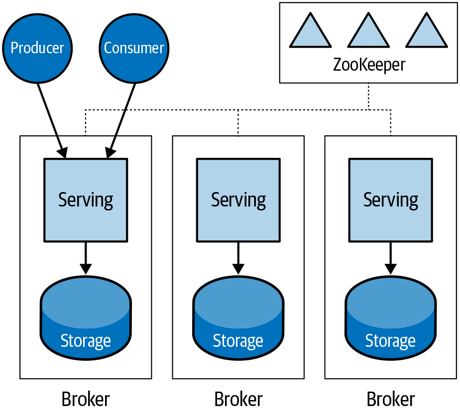

*Figure 1. Kafka architecture*

The Kafka broker provides the full messaging capabilities of Kafka. It terminates producer and consumer connections, accepting new messages from producers and sending messages to consumers. In order to provide message guarantees, the Kafka broker also provides persistent storage for messages on disk. Each Kafka broker is responsible for a set of topics.

The Kafka broker is stateful. Each broker contains the complete state for its topics and requires that information to operate properly. If one broker fails, not just any broker can take over for it. Only another broker that has a replica of its topics can take over. If the load is getting too high on one broker, you can’t simply add another broker to distribute the load. You also need to move the topics—the state—around to balance the load in the cluster. Kafka provides tools to help with the rebalancing, but to operate a Kafka cluster, you must be aware of this relationship between the Kafka broker and the message state stored on its disk.

The serving of messages—the movement of messages between producers and consumers—is coupled to the storing of messages in the Kafka broker. If you have a messaging pattern where all messages are quickly consumed, the need for storing messages may be low, but the need for serving messages can be high. Alternatively, you may have a messaging pattern where a large number of messages need to be stored because they are consumed slowly. In this case, the need to serve messages may be low, while the need to store them is high.

Because the serving and stored messages are encapsulated in a single Kafka broker, you cannot easily scale out these dimensions independently. If you have high serving requirements in your cluster, you have to scale both serving and storage capacity because the solution is to add a Kafka broker. If you have high storage requirements, but low serving requirements the easiest thing to do is to just add more Kafka brokers, which scales out both the serving and storage capacity.

In the storage scaling case, you could add more disks or grow the disks on the existing brokers, but you will want to be careful not to create a set of unique Kafka brokers, each having a different storage configuration and capacity. An environment with “snowflake” servers is much more complex to manage than one where each server of a specific type is identically configured.

## Pulsar

In the Pulsar architecture, there are three main components: ZooKeeper, Pulsar broker, and Apache BookKeeper bookie, as shown in [Figure 2]. As with Kafka, ZooKeeper provides service discovery, leadership elections, and metadata storage. Unlike Kafka, Pulsar separates the message serving function from the message storage function using Pulsar broker and the BookKeeper bookie component.

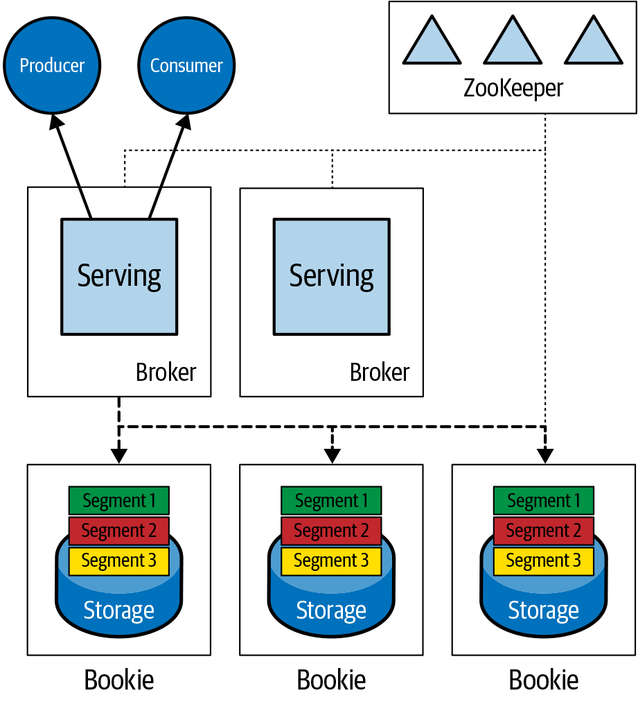

*Figure 2. Pulsar architecture*

The Pulsar broker is responsible for the serving of messages. The storing of messages is handled by the BookKeeper bookies. It is a layered architecture where the Pulsar broker handles serving the messages between the producers and consumers but hands off responsibility for storing the messages to the BookKeeper layer.

Because of this layered architecture, the Pulsar broker (unlike Kafka) is stateless. This means that any broker can take over for any other failed broker. It also means that a new broker can be brought online and it can immediately begin serving messages between producers and consumers. To make sure the load between brokers is balanced, the Pulsar broker has a built-in load balancer. It continually monitors the CPU, memory, and network usage of each broker and will move responsibility for topics between brokers in order to maintain a balanced load. When it does this, there is a small increase in latency, but the end result is a cluster with a balanced load.

The BookKeeper layer is the data storage layer and is, of course, stateful. A messaging system that provides message delivery guarantees must retain messages for consumers, so messages must be persistently stored somewhere. BookKeeper was designed to enable the building of a distributed log across multiple servers. It is an independent Apache project and is used in a variety of applications, not just Pulsar.

Because BookKeeper breaks the log into segments called ledgers, it is easy to maintain an even balance between the BookKeeper bookie nodes. If a bookie node fails, some of the topics will become under replicated. In this case, BookKeeper will automatically start copying ledgers from replicas stored on other bookies to restore the replication factor. It does not have to wait for the failed bookie to be restored or another bookie to come online. If you add a new bookie, it will immediately start storing new ledgers from existing topics. There is no need to move topics or partitions to the new server because no one bookie owns the topic or partition.

## Replication Model

For durability of messages, both Kafka and Pulsar store multiple copies, or replicas, of each message. However, they differ in the replication model they use.

Kafka has a leader–follower replication model. One of the Kafka brokers is elected the leader for a topic (technically a topic partition—more on that later). All messages are initially written to the leader, and the followers read and replicate the messages from the leader, as shown in [Figure 3]. Unless there is a failure of one of the Kafka brokers, this relationship is static. A message is written to the same set of leader and follower brokers. Introducing a new broker doesn’t change the relationship for existing topics.

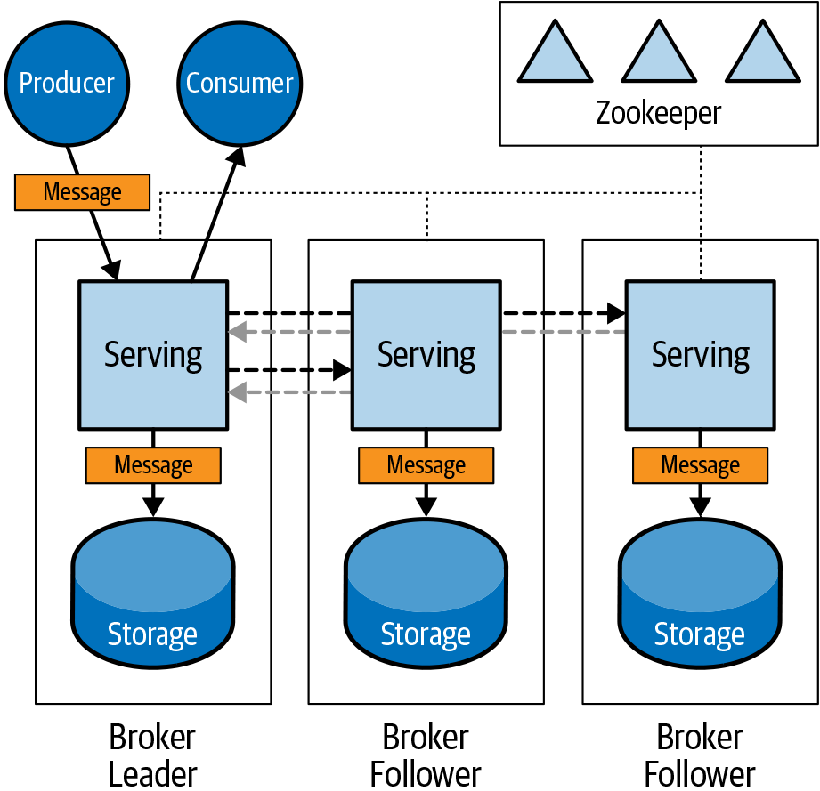

*Figure 3. Kafka leader–follower replication*

Pulsar uses a quorum–vote replication model. Multiple copies of the message (write quorum) are written in parallel. Once some number of copies have been confirmed stored, then the message is acknowledged (ack quorum). Unlike the leader–follower model, Pulsar can spread (or stripe) the copies over a set of storage nodes (ensemble), which can improve the read and write performance. This also means that as soon as a new node is added it will become part of the set available for spreading the messages across.

In [Figure 4], the message is sent to the broker. It is then broken into segments and sent to multiple bookie nodes. All the bookie nodes store the segments and acknowledge back to the broker. Once the broker has received enough acknowledgements for the segments from enough bookies, it will acknowledge the message back to the producer.

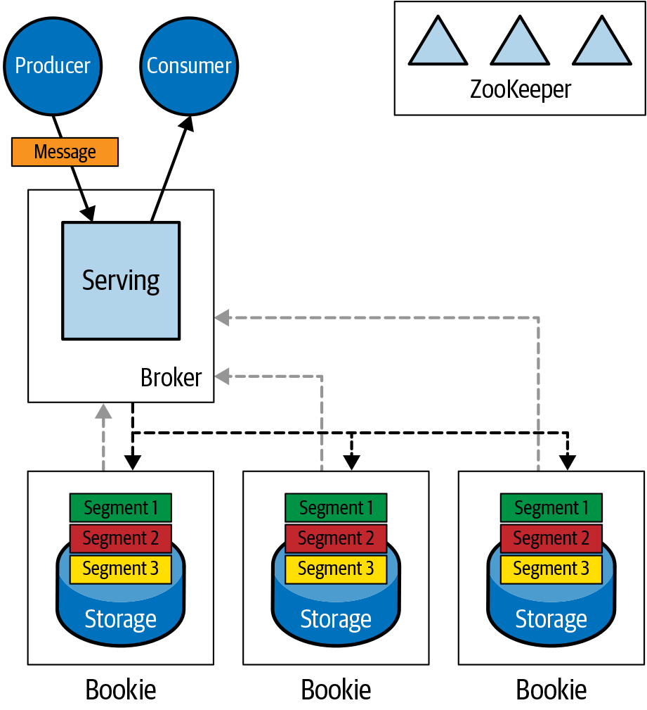

*Figure 4. Pulsar quorum–vote replication*

Because brokers are stateless, the storage layer is distributed, and the quorum–vote replication model is used, dealing with failed servers is easier in Pulsar than in Kafka. You just replace the failed server, and Pulsar recovers automatically. Adding new capacity to the cluster is also easier. It is just a matter of simple horizontal scaling.

And because the serving and storage layers are separated, you can scale them independently. If the serving requirements are high and storage requirements are low, you can just add more Pulsar brokers to the cluster. If the storage requirements are high but the serving requirements are low, you can just add more BookKeeper bookies. This independent scalability means you can better optimize your cluster resources, avoiding paying for extra storage when you just need extra serving power and vice versa.

# Pub–Sub Messaging: An Overview

The fundamental messaging pattern supported by both Kafka and Pulsar is pub–sub, or publish–subscribe. In pub–sub messaging, the senders and receivers of messages are decoupled, so that they have no knowledge of each other. The sender (or producer) publishes a message to a topic without knowledge of who will receive the message. The receiver (or consumer) subscribes to a topic that it wants to receive messages for. The sender and receiver are not connected and can change over time.

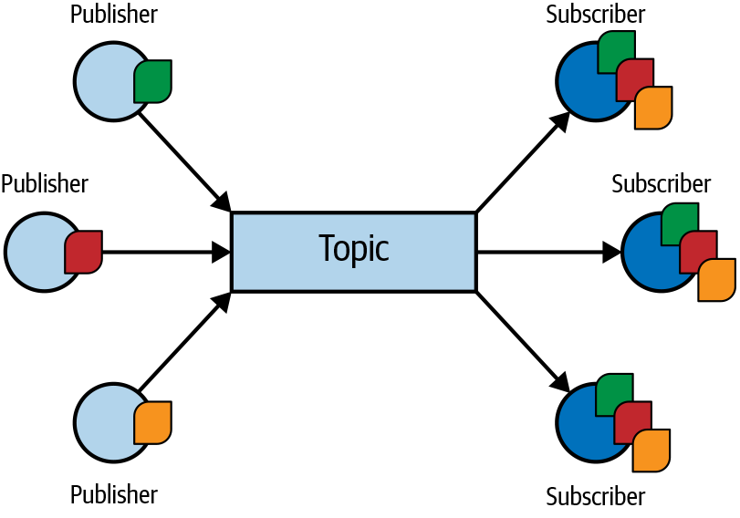

*Figure 5. Pub–sub messaging pattern—each subscriber gets a copy of the messages sent by the producer*

A key feature of the pub–sub message pattern is that there can be multiple publishers and subscribers on a single topic. As shown in [Figure 5], many publishing applications can be sending messages to a single topic, and many different subscribing applications can be receiving those messages. Importantly, each subscribing application receives its own copy of the message. So, if a single message is published and there are 10 subscribers, 10 copies of that message are sent, one for each subscriber.

The pub–sub messaging pattern is not new and can be achieved using a wide variety of message brokers: RabbitMQ, ActiveMQ, IBM MQ—the list is long. What differentiates Kafka from these traditional message brokers is its ability to scale to support high volumes of messages in the pub–sub pattern while maintaining consistent per-message latency.

Like Kafka, Pulsar supports the pub–sub messaging pattern and can support high volumes of messages with consistent latency. Kafka uses consumer groups to enable multiple consumers to receive a copy of a single message. For each consumer group associated with a topic, Kafka delivers one message to the group. Pulsar achieves the same behavior using a subscription. For each subscription associated with a topic, Pulsar delivers one message to the subscription.

## Log Abstraction

The other main difference between Kafka and traditional message brokers is its use of the log as its primary abstraction for dealing with messages. Producers write to a topic, which is a log, and consumers independently read from the log. However, unlike traditional message brokers, messages once read are not removed from the log. They are persistent in the log for a configurable amount of time. Instead of consumers acknowledging a message to the broker, which then deletes it, a Kafka consumer indicates how much of the log it has read by committing an offset value. This action does not delete the message from the log or modify it in any way. The log is immutable.

To prevent the log from becoming infinitely long, messages in the log expire (typically) after a period of time (retention period). Expired messages are removed from the log. In Kafka, the default retention period is seven days. [Figure 6] illustrates how published messages are appended to the log, while consumers read at different offsets. In time, messages in the log expire and are removed.

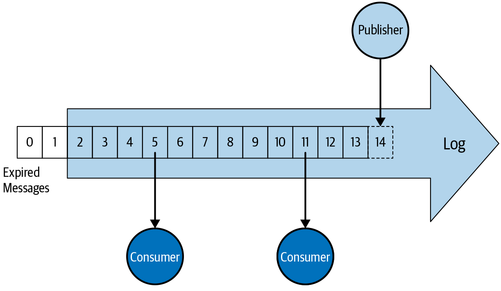

*Figure 6. The log abstraction*

## Message Replay

This use of a log abstraction allows for multiple consumers to read from a topic independently. It also enables message reply. Since a consumer is just reading from the log and committing its place (offset) in the log, it is easy to have a consumer go back in time to messages it has already read by moving its offset to an earlier position. Being able to replay messages has many advantages. For example, it allows an application with bugs to be repaired and then will replay previously consumed messages to correct its state. It is also useful to replay messages when testing applications or developing new applications.

Like Kafka, Pulsar uses a log abstraction for its topics, but with a different implementation (more on that later). This means that it also supports message replay like Kafka does. With Pulsar, each subscription you create has a cursor that tracks where the subscription is in the topic log. You can create a subscription with the cursor starting at the earliest or latest message in a topic. You can rewind the subscription cursor to a specific message or back a certain amount of time (for example, 24 hours).

# Traditional Messaging

So far, Kafka and Pulsar have many similarities. They both are pub–sub messaging systems that can handle high messaging volumes. They use a log abstraction for topics and support the replay of messages. Where they differ is in their support of the traditional messaging model.

In the traditional messaging model, the messaging system takes responsibility for ensuring a message is delivered to the consumer. It does this by keeping track of whether or not the consumer has acknowledged a message and will periodically redeliver that message to the consumer until it has been acknowledged. Once the message has been acknowledged, it is deleted (or marked for future deletion). An unacknowledged message is never deleted. It will persist forever. An acknowledged message is never sent to a consumer.

Pulsar fully supports this model using subscriptions. Because of this capability, Pulsar is able to support additional messaging patterns that focus on how the message is consumed.

# Queues and Competing Consumers

The first pattern we are going to look at is the traditional queue. This model is most interesting when the messages on the queue represent some work to be done (work queue). You can have a single consumer read the messages off the queue and do that work, but it often makes sense to distribute the work among multiple consumers. This is called the competing consumers pattern and is shown in [Figure 7].

In the competing consumers pattern, queues are used to store messages that take a long time to process—for example, transcoding a video. A message is published into a queue and a consumer reads that message and processes it. Once the message is processed, the consumer sends an acknowledgment and the message is removed from the queue. With a single consumer, all the messages in the queue that need to be worked on are blocked until the message is processed and acknowledged.

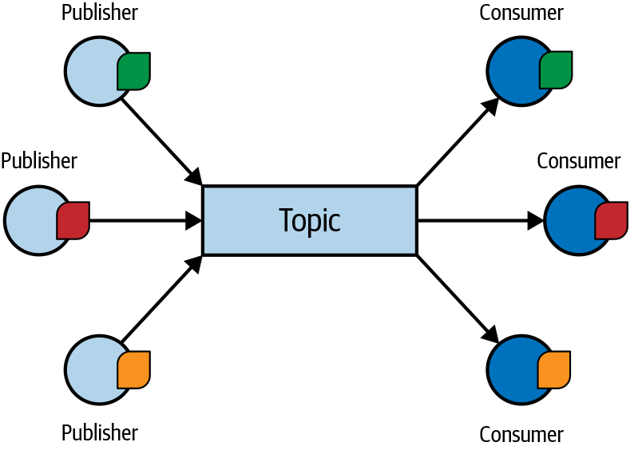

*Figure 7. Competing consumers—each message is processed once by one of the consumers*

To improve the flow and keep the queue from getting backed up, you add multiple consumers to the queue. Now, multiple consumers “compete” to take messages from the queue and process them. With two consumers in our video transcoding example, the system can process twice as many videos in the same amount of time. If that is not fast enough, we can add more consumers to increase the throughput.

To be most effective, a work queue should always distribute messages to consumers that are able to perform work on the messages in the queue. If a consumer is available to process a message, the queue should send it that message.

## Kafka

Kafka implements the competing consumers pattern using consumer groups and multiple partitions. In Kafka, topics consist of one or more partitions. When messages are published they are distributed to the partitions of the topic in a round-robin manner or by a key in the message. Consumer groups read from the partitions of a topic.

Importantly, in Kafka a partition can only be consumed by one consumer at a time. To get competing consumers to work, there needs to be a partition for each consumer. If there are more consumers than partitions, the extra consumers will be idle. For example, if you have a topic with two partitions, you can have up to two active consumers in the consumer group. If you add a third consumer to the group, it won’t have a partition to read from, so it won’t be competing for the work (messages) on the queue.

This means you need to have an idea how many competing consumers you will need when you create the topic. You can increase the number of partitions on a topic, but this is a fairly significant change, especially if you are assigning partitions based on keys. In addition to the relationship between consumers and partitions in Kafka, adding a new consumer to a consumer group causes a rebalance of all the consumers on the topic. This rebalancing causes a pause in message delivery for all consumers.

So Kafka does support the competing consumers messaging pattern, but you need to manage the number of partitions on a topic carefully to make sure that when adding a new consumer that consumer will actually process messages. Also, unlike a traditional message broker, Kafka does not periodically redeliver messages so that they can be processed again. If you want a message retry mechanism, you have to implement it in your application.

Kafka does have an advantage over traditional brokers in this area. One of the downsides to the competing consumers pattern is that messages can be processed out of order. Because you have multiple consumers competing to consume messages that may be working at different rates, it is very likely that messages will be processed out of order. If the message represents a unit of independent work, this is not an issue. But if the message represents an event like a financial transaction, order matters.

Because of its use of partitions and the rule that only one consumer can consume from a partition at a time, Kafka is able to guarantee in-order delivery of messages that have the same key with competing consumers. If messages are routed to partitions by key, then the messages in each partition are in publishing order for that key. A consumer can consume off that partition getting the messages in order. This allows you to scale out consumers for parallel processing—with some careful planning—and maintain message order.

## Pulsar

In Pulsar, the competing consumers pattern is easy to implement. You just create a shared subscription on a topic. Consumers then connect to the topic using this shared subscription. Messages are consumed in a round-robin fashion by however many consumers are connected to that subscription. Consumers coming and going doesn’t trigger rebalancing like it does in Kafka. When a new consumer connects it starts participating in the round-robin receipt of messages. This is because unlike Kafka, Pulsar doesn’t use partitions to distribute messages between consumers. This is all controlled by the Pulsar subscription. Pulsar does support partitions, which are discussed later, but message consumption is primarily controlled by a subscription, not a partition.

A Pulsar subscription will periodically redeliver unacknowledged messages to consumers. Not only that, it supports advanced acknowledgment semantics, such as single-message (selective) acknowledgement and negative acknowledgment, which are useful for work queues. Single-message acknowledgement allows messages to be acknowledged out of order, so that one slow consumer doesn’t end up blocking the delivery of messages to other consumers, which can happen when messages are acknowledged by cumulative range. Negative acknowledgement allows a consumer to put a message back on the topic to be handled by another consumer or processed later.

Pulsar supports routing messages to partitions by key, so it is also possible to implement competing consumers just like in Kafka. A shared subscription is simpler, but if you need to guarantee message order by key while scaling out consumers for parallel processing you can do that in Pulsar too.

## Pulsar Subscription Models

The shared subscription is an easy way to implement a work queue in Pulsar. Pulsar also supports additional subscription models that enable other message consumption patterns: exclusive, failover, shared, and key_shared, which are shown in [Figure 8].

With an exclusive subscription, no more than one consumer is allowed to consume messages from the topic. If any other consumer attempts to consume a message, it is rejected. This is useful if you need to guarantee that messages are processed in order by a single consumer.

With a failover subscription, multiple consumers are allowed to connect to a topic, but at any given time only one is allowed to consume from the topic. This establishes an active–standby relationship where one consumer is active for the subscription and any other consumers are on standby waiting to take over if the active consumer fails. When the active consumer disconnects or fails, all unacknowledged messages are redelivered to one of the standby consumers.

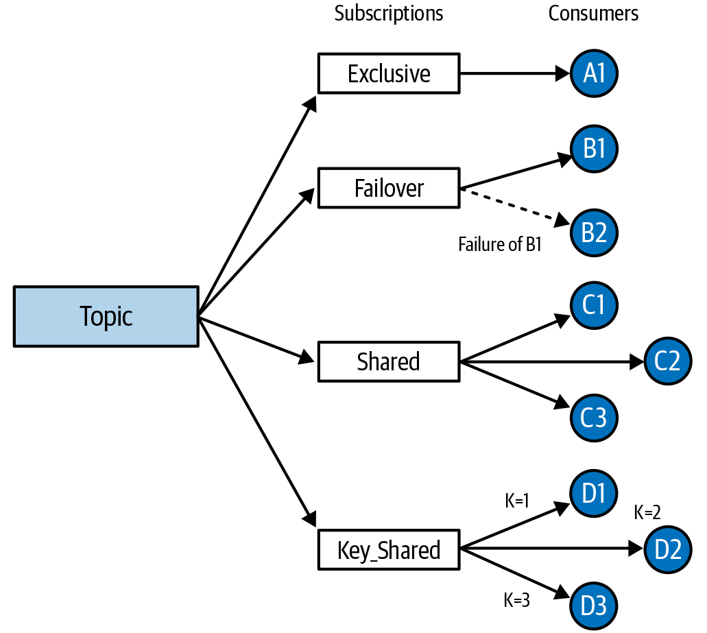

*Figure 8. Pulsar subscription models: exclusive, failover, shared, and key_shared*

As was already mentioned, one of the weaknesses of the competing consumers pattern as it is implemented in a shared subscription model is that messages can be processed out of order. In both Kafka and Pulsar, you can get around this by routing messages to partitions by key. Pulsar has recently introduced a new subscription model called key_shared that makes this even easier. This subscription model has the advantages of in-order delivery of messages by key without having to deal with partitions. Messages can be published to a single topic and distributed to multiple consumers like with a shared subscription. However, individual consumers only receive messages for a single key. With this type of subscription, it is possible to get in-order delivery of messages by key without having to partition the topic.

# Pulsar: Pub–Sub and Queue Together

As we have seen, both Kafka and Pulsar are able to support pub–sub messaging. They both use a log abstraction for their topics, so they are able to replay messages that have already been processed by consumers. But Kafka only has limited support for different ways a message can be consumed. It does not do automatic message redelivery and cannot guarantee that an unacknowledged message will not be lost. In fact, all messages outside the retention period are deleted, whether or not they have been consumed. Work queues with competing consumers can be implemented in Kafka, but with several caveats and considerations.

Because of these limitations, organizations needing high-performance pub–sub messaging, delivery guarantees, and traditional messaging patterns often implement a traditional message broker like RabbitMQ alongside Kafka. They use Kafka for their high-performance pub–sub use cases and RabbitMQ for use cases that require delivery guarantees, such as work queues.

Pulsar can support high-performance pub–sub and traditional messaging patterns with delivery guarantees in a single messaging system. It is not difficult to implement a work queue using Pulsar—in fact, this was one of the original use cases that Pulsar was designed to handle. In organizations that have deployed parallel messaging systems, Kafka to handle high volume pub–sub and RabbitMQ to handle work queues, Pulsar can be used to consolidate down to one messaging system. Or even if only one type of messaging is initially required, Pulsar can be deployed to future proof against the emergence of new use cases.

Operating one messaging system instead of two is, obviously, a lot easier, requiring fewer resources, both IT and human.

# Log Abstraction

Now that we have looked at the high-level architecture of Kafka and Pulsar and covered the messaging patterns that can be implemented in both systems, let’s go into more detail about the building blocks of these systems. First, we’ll discuss the log abstraction.

The Kafka team deserves credit for the insight that a log is a great abstraction for a real-time data exchange system. Because logs are append-only, data can be written to them quickly, and because the data in a log is sequential, it can be extracted quickly in the order that it was written. Sequential reading and writing is fast, random is not. Persistent storage interactions are a bottleneck in any system that offers data guarantees, and the log abstraction makes this about as efficient as possible. Both Kafka and Pulsar use the log as their fundamental building block.

For the sake of simplicity, let’s assume a single-partition Kafka topic in the following sections, so that topic and partition are synonymous.

## Kafka Log

In Kafka, each topic is a log. Logs are stored on the Kafka broker as a single unit. A log, though implemented as a series of files, cannot be split between multiple brokers or between multiple disks on the same broker. This log as-a-single-unit generally works well, but it can cause complications at scale and during maintenance activities.

For example, the maximum size of any log is limited by the disk that it is on. So, the disk on the broker that stores the log constrains the size of the topic. Adding another disk to the broker won’t help, since logs are a single unit and can’t be split across disks. The only option is to increase the size of the disk. In cloud environments this is possible, but if you are running on physical hardware, increasing the size of an existing disk is not an easy undertaking.

Another complication of having this one-to-one relationship between the log and its backing files comes when trying to perform maintenance operations on a live system. If a broker server fails or you need to add a new broker to accommodate higher load, you end up copying sometimes large sets of log files between servers. Doing these large file copies while trying to keep up with real-time data can create a lot of strain on a Kafka cluster.

## Pulsar Distributed Log

Like Kafka, Apache Pulsar uses a log abstraction as the basis of its real-time messaging system. Every topic is a log in Pulsar as well. However, it takes a different approach to writing the log to storage. Instead of writing the log as a single unit on a single server, Pulsar breaks up the log into segments or ledgers. It then distributes those ledgers across multiple servers. In this way, it creates a distributed log that resides on multiple servers.

A distributed log has several advantages. The maximum size of the log is no longer limited by the disk capacity of a single server. Since the segments are distributed across multiple servers, the log can grow to be as big as the total storage capacity of all the servers. Increasing the capacity of the distributed log is as simple as adding a new server to the cluster. Once the new server comes online, the distributed log can start using the extra capacity to write new log segments. There is no need to resize disks or rebalance partitions to distribute the load. And if a server fails, recovering from that failure is easier. Lost segments can be recovered from multiple different servers, improving recovery time.

As you can imagine, getting a distributed log to work reliably is difficult. That is why Pulsar uses another Apache project, BookKeeper, to implement its distributed log. As part of running Pulsar, you need to run an Apache BookKeeper cluster. Although this introduces operational complexity, it provides the building blocks for the distributed log using a proven and widely adopted technology that is optimized for this use case. BookKeeper is designed for robust, low-latency writes and reads. The architecture of BookKeeper separates writing and reading onto separate disks so that, for example, slow consumers won’t impact the ability of producers to publish new messages.

BookKeeper also allows Pulsar to provide high durability guarantees. When a message is stored in BookKeeper, it is flushed to disk before it is acknowledged back to the producer. If the server running BookKeeper fails, all acknowledged messages are guaranteed to have been stored permanently on disk. BookKeeper is able to provide this high durability guarantee while maintaining low latency.

Contrast this to Kafka, which flushes messages to disk periodically by default. This means that a failure of a Kafka broker will almost always cause messages to be lost because they haven’t been flushed to disk. Of course, if you are running with in-service replicas, these lost messages can be recovered, but under a similar failure of a BookKeeper server, no recovery would be necessary since no messages would be lost. Kafka can be configured to flush each message to disk, but this comes with a performance penalty.

## Tiered Storage

Another advantage of separating the serving and storing in Pulsar is that it allows for the introduction of a third layer to the architecture: long-term (or cold) storage. Pulsar and BookKeeper are optimized for fast access to the messages stored in its topics. However, if you have a large set of messages but don’t need fast access to those messages, or you only need fast access to the latest messages, Pulsar lets you push those messages to cloud object storage such as AWS S3 or Google Cloud Storage. It does this by offloading older segments of a topic to the cloud provider and then removing them from the bookie local storage.

Cloud object storage is significantly cheaper than the high-speed SSD drives that you would typically use to build a high-performing messaging cluster, so operational costs can be reduced. Since cloud storage provides practically infinite storage capacity, you don’t have to worry about exceeding the storage capacity of your cluster. You could have one very large topic that mostly resides in cloud storage, while all the other smaller topics are served by the high-speed disks attached to the bookie nodes.

Moving to this three-layer architecture can fit nicely with use cases that require permanent storage of messages, such as event sourcing. With event sourcing all changes in state are recorded as events, which can be saved as messages in Pulsar. The current state of an application is determined by the entire history of events until the current time. To ensure that you can always reconstruct the current state, you must save the entire event history. Given Pulsar’s durability guarantees, practically infinite storage capacity when using tiered storage, and ability to replay all messages in a topic, it can be a good fit for event sourcing application architectures.

# Partitions

If you have used Kafka at all you are familiar with partitions. We have already touched on them several times in this report because it is unavoidable. Partitions are a fundamental concept in Kafka, and can be very useful. Pulsar also supports partitions, but they are optional.

## Kafka Partitions

In Kafka, all topics are partitioned. A topic may have only one partition, but it has to have at least one partition. Partitions are important because they are the fundamental unit of parallelism in Kafka. By spreading the work across partitions and therefore multiple brokers, the rate that can be processed by a single topic goes up. When Kafka was created, partitioning was needed to meet the high-throughput use cases Kafka was designed to tackle, especially since the goal was to be able to use commodity hardware.

In the years since Kafka’s inception, the capacity of commodity hardware has improved. Plus, there have been performance improvements in the Java virtual machine that Kafka runs on. These hardware and software improvements mean that today you can get good performance with a single partition using commodity hardware. From a performance perspective, a topic with a single partition is good enough for many use cases.

However, as we’ve already discussed, if you ever want to have multiple consumers read from your topic in Kafka, you can’t use a single partition. That’s because partitions are the unit of parallelism for production and consumption in Kafka. So even if a single partition is good enough for the incoming messaging rate to a topic, you will probably want to use multiple partitions so that you have the option of adding multiple consumers in the future. Yes, you can add partitions to a topic later, but if you are using key-based partitioning, this may change which keys are assigned to which partitions, which can affect the in-order processing of messages in a partition. Partitions consume resources (for example, file handles on the broker, memory on the client) so they are not lightweight. And although you can increase the number of partitions on a topic, you can never decrease the number of partitions on a topic.

Since partitions are fundamental to Kafka, to properly use Kafka you need to understand how they work. You need to consider the number of partitions you need (or might need in the future) when creating a topic. When connecting consumers, you need to understand how they interact with partitions in their consumer groups. And if you operate a Kafka cluster, everything works at the partition level, so you need to be partition-centric when doing maintenance and repairs.

## Pulsar Partitions

Pulsar also supports partitions, but they are completely optional. In fact, it is possible to run Pulsar without using partitions at all. You can create topics that you can publish a high volume of messages into and have multiple consumers consuming them from without using partitions. If you need additional performance or need key-based, in-order message consumption, you can create partitioned topics in Pulsar. They are fully supported, providing most of the same capabilities as Kafka.

In Pulsar, partitions are implemented as a collection of topics with a suffix to indicate the partition number. For example, if you create a topic “mytopic” with three partitions, three topics will be automatically created with the names “mytopic-partition-1,” “mytopic-partition-2,” and “mytopic-partition-3.” Producers can connect to the main topic, “mytopic,” and the messages will be sent to the partition topics based on the routing mode defined by the publisher. It is also possible to publish directly to a partition topic. Similarly, a consumer can connect to the main topic or one of the partition topics. Like Kafka, you can increase the number of partitions for a topic, but you can never decrease the number of partitions.

Since partitions are optional in Pulsar, working with Pulsar is simpler, especially when you are first learning it. You can safely ignore partitions in Pulsar, unless you have use cases that demand the features provided by partitions. Not only does this simplify the operation of a Pulsar cluster, it makes dealing with Pulsar client APIs easier. Partitions are a useful concept, but if you can get by without dealing with them, it helps to simplify an inherently complex technology.

# Performance

Kafka is known for its performance. It made its mark by being able to support high volumes of messages in real-time environments. Comparing performance between messaging systems can be tricky. All systems have performance sweet spots and performance blind spots. To make a fair comparison between them is difficult.

One project that aims to make performance comparisons between messaging systems fair is the [OpenMessaging Project](http://openmessaging.cloud/), a Linux Foundation Collaborative Project. The OpenMessaging Project, which is supported by multiple providers of messaging systems, has a goal of providing vendor-neutral and language-independent standards for messaging and streaming technologies. The project includes a performance testing framework that supports various messaging technologies, including Kafka and Pulsar.

The idea is that by using a standard test framework and methodology, a certain degree of fairness can be introduced into the evaluation. All the code for the OpenMessaging Project is open source and anyone is welcome to run the benchmark tests and produce their own results.

Going through a detailed performance analysis between Kafka and Pulsar is outside the scope of this report. However, there are published results using the OpenMessage Project benchmark framework that indicate Pulsar outperforms Kafka.

A [report](https://oreil.ly/vGoPy) published by GigaOm provides these headline results:

- Up to 150% higher maximum throughput with Pulsar
- Up to 40% lower message latency and greater consistency in latency with Pulsar
- Better scalability that delivers consistent results across a range of message sizes and partition counts

To validate some of these results, I have done a [detailed comparison](https://oreil.ly/34h_v) of the latency between Kafka and Pulsar using the OpenMessage Project benchmark framework. In that comparison, I came to the conclusion that Pulsar provides more predictable latency over time. In many cases, Pulsar provides lower latency than Kafka, especially if you need strong durability guarantees or a large number of partitions.

# Tenancy

Tenancy is the number of users or groups of users that can use the system independently. In a single tenant system, all the resources of the system are shared, so users of the system have to be aware of what other users of the system are doing. Since the resources are shared, this introduces contention and possible collisions. When using a single-tenant system with multiple user groups, you typically need to use multiple copies of the system, one for each group, to provide isolation and privacy.

In a multitenant system, different user groups, or tenants, can use the system independently. Each tenant is separate from the other tenants of the system. Resources are divided between tenants so each tenant has their own private instance of the system. There is one system, but each tenant gets their own virtual, isolated environment. A multitenant system can support multiple user groups.

Since a messaging system is core infrastructure, it will eventually be used by different teams for different projects. Having to create a new cluster for each team or project is operationally complex and doesn’t make efficient use of resources. Because of this, multitenancy in a messaging system is a desirable feature.

## Pulsar

Multitenancy was a key design requirement of Pulsar. Because of that, Pulsar has several multitenancy features that allows it to support multiple teams or multiple projects within a single Pulsar system.

In Pulsar, a tenant has its own virtual messaging environment separate from the other tenants. Topics created by one tenant are separate from topics created by another tenant. Typically, a tenant will be used by all members of a team or department. Each tenant can have multiple namespaces. A namespace is a grouping of topics. The same topic name can exist in multiple namespaces. A namespace is a convenient way to group all the topics involved in specific project.

Namespaces are also a mechanism for sharing policy configuration between topics. For example, all the topics that need a retention time of 14 days can be grouped into a namespace. By setting this policy on the namespace, all topics in that namespace inherit that policy.

When there are multiple tenants sharing a resource, it is important to have mechanisms to ensure that all tenants get fair access. You want to ensure that one tenant doesn’t consume all resources, starving out the other tenants.

Pulsar has a number of policies that can be used to ensure that a single tenant doesn’t consume all the resources of the cluster. There are policies that limit outbound message rate, unacknowledged message storage, and message retention periods. These policies can all be set at the namespace level, so that groups of topics can have different policies.

In order for multitenancy to work, Pulsar supports authorization at the namespace level. This means you can limit access to topics in a namespace. You can control who is allowed to create topics in a namespace and who is allowed to produce and consume from those topics.

## Kafka

Kafka is a single-tenant system. There is a global namespace for all topics. Policies such as retention time can be set as a global default, or overridden on individual topics. There is no ability to group related topics together or apply policy on an arbitrary group of topics.

For authorization, Kafka supports access control lists (ACLs), which allow you to restrict who can produce and consume from a topic. ACLs allows fine-grain control over authorization in the cluster. You can set policies on various resources such as the cluster, topics, and consumer groups. You can also specify various specific operations such as create, describe, alter, and delete. In addition to authorization based on user (principal), you can also define host-based authorization. For example, you can allow User:Bob to write to and read from a topic but only from IP address 198.51.100.0. This detailed level of authorization and host-based restrictions is not available in Pulsar, which only supports a handful of operations (administer, produce, consume) and does not offer host-based authorization.

Although Kafka has more flexibility with its authorization controls, it is still fundamentally a single-tenant system. If multiple groups are using the same Kafka cluster, they need to ensure that their topic names don’t collide and that ACLs are applied correctly. With Pulsar, multitenancy is built in, so sharing a cluster between different teams and project groups is straightforward.

# Geo-Replication

For systems like Kafka and Pulsar to achieve high performance, it’s important for their components to be located close together so they can achieve low-latency communication between them. This means that Kafka and Pulsar are deployed in a single data center with high-speed networking between the components. Replication of messages within a cluster protects you from message loss and downtime when one (or possibly more) components (compute, storage, network) of the cluster fails. In cloud environments, the components can be distributed between availability zones within a data center (region) to protect against the failures of a zone.

If the entire data center fails or becomes isolated then there will be an outage (or loss, in the event of a disaster) of the messaging system. If this is not acceptable for your use case, then you can use geo-replication. With geo-replication, messages are replicated to another cluster at a remote location. For every message published in one data center, that message is automatically—and reliably—copied to another data center. This protects against the failure of an entire data center.

Geo-replication is also useful for global applications that have messages produced in one part of the world being consumed by consumers in other parts of the world. By replicating messages to remote data centers, load can be distributed and responsiveness for clients can be improved.

## Pulsar

When the team at Yahoo! set out to build what would eventually become Apache Pulsar, the ability to replicate messages between geographically distant data centers was a key requirement. They needed to make sure that messages would still be available even if an entire data center failed. So with Pulsar, geo-replication is a core feature, fully integrated into the administration interfaces. Geo-replication can be enabled and disabled at the namespace level. The administrator can easily configure which topics will be replicated and which will not be replicated. Individual producers can even exclude certain data centers from receiving a copy of the messages that it publishes.

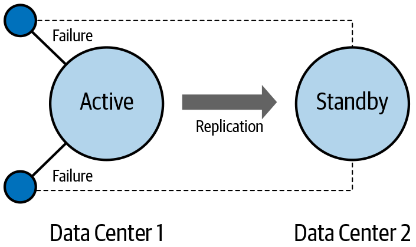

*Figure 9. Active–standby replication*

Geo-replication in Pulsar supports multiple topologies, such as active-standby, active–active, full mesh, and edge aggregation. [Figure 9] illustrates active–standby replication. All messages published to the active data center (Data Center 1) are replicated to the standby data center (Data Center 2). If the active data center fails, clients can connect to the standby data center. For active–standby replication, Pulsar has recently introduced replicated subscriptions. This feature keeps the subscription state synchronized between the active and standby clusters so that applications can switch to the backup data center and pick up where they left off.

In active–standby replication, clients are only connected to one data center at a time. In active–active replication, which is shown in [Figure 10] in a full-mesh configuration, clients connect to multiple data centers. The messages published in one data center are replicated to multiple data centers.

[Figure 11] shows an edge-aggregation topology. In this topology, clients connect to multiple data centers that replicate the messages to a central data center for processing. If the edge data centers are located near the clients, then this allows for quick message acknowledgment of published messages even if the central data center is geographically distant.

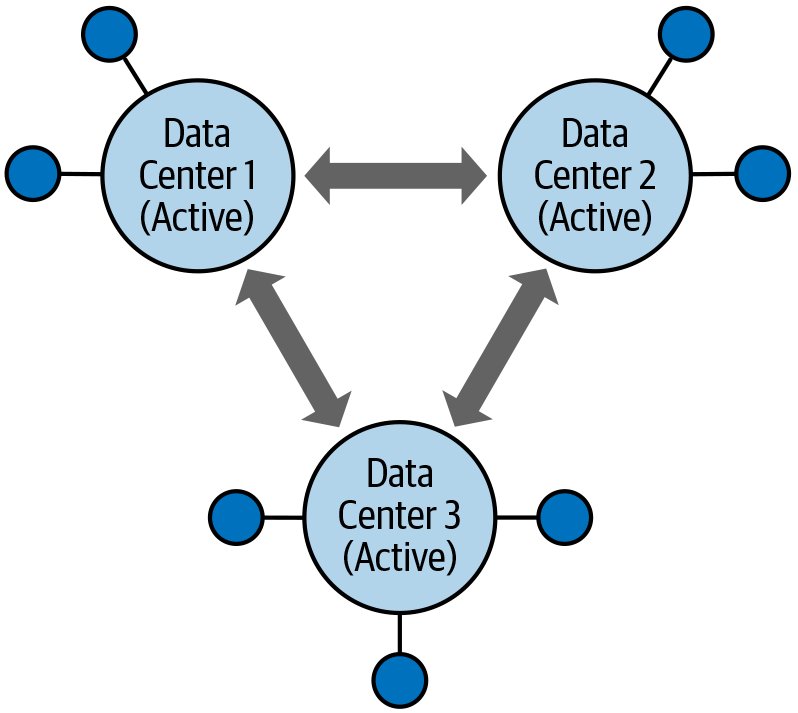

*Figure 10. Active–active, full-mesh replication*

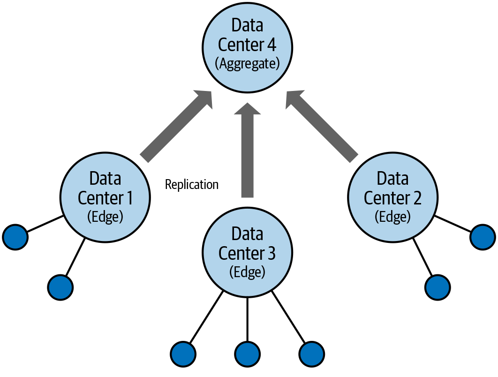

*Figure 11. Edge aggregation*

It is also possible to do synchronous geo-replication with Pulsar. In a typical geo-replication setup, the message replication is done asynchronously. A producer sends a message to its primary data center. The message is persisted and acknowledged back to the producer. It is then reliably copied to the remote data center. The overall process is asynchronous because the message is acknowledged to the producer before it is replicated to the remote data center. This works fine as long as the remote data center is operational and reachable through the network. However, if there is a problem with the remote data center or the network connection is slow, the acknowledged message may be waiting to be copied to the remote data center. If the primary data center fails before the message can be copied to the remote data center, then the message can be lost.

If this type of loss is not acceptable for your use case, you can configure Pulsar to do synchronous replication. With synchronous replication the message is not acknowledged back to the production until it is safely stored in multiple data centers. Since the messages need to be sent to multiple data centers that are geographically distant, this setup will take longer to acknowledge published messages because of the network latency between the data centers. However, this ensures that messages will not be lost even in the event of the complete failure of a data center.

Pulsar has a rich set of geo-replication functionality that supports almost any configuration you can think of. The configuration and management of geo-replication is fully integrated into Pulsar and does not require external packages or extensions.

## Kafka

There are multiple ways to do geo-replication in Kafka, or mirroring, as it is called in the Kafka documentation. Kafka includes a tool called MirrorMaker that replicates messages from one cluster to another cluster as they are produced. It is a simple tool that connects a Kafka consumer in one data center to a Kafka producer in another. It cannot be dynamically configured (you need to stop and start the tool to change its configuration) and it does not provide any configuration or subscription synchronization between the local and remote cluster.

Another geo-replication option is uReplicator, which was developed by Uber and then open sourced. Uber created uReplicator to address many of the shortcomings of MirrorMaker, improving its performance, scalability, and operations. Certainly, uReplicator is a better geo-replication solution for Kafka. However, it is an independent distributed system with controller and worker nodes that needs to be operated in parallel with the Kafka cluster.

There are also commercial solutions for geo-replication in Kafka, such as Confluent Replicator. The Confluent Replicator supports active–active replication, synchronizes configuration between clusters, and is easier to operate than MirrorMaker. It depends on Kafka Connect, which is a distributed system that needs to be operated in parallel with the Kafka cluster.

Geo-replication is possible in Kafka, but it’s not simple. From having to choose among multiple solutions to having to run parallel tools or entire distributed systems to support it, geo-replication is complex, especially when compared to Pulsar’s built-in geo-replication capabilities.

# Ecosystem

We have spent a lot of time looking at the core Kafka and Pulsar technology. Now let’s zoom out and take a look at the bigger picture of the ecosystem that surrounds each project.

## Community and Related Projects

Kafka was open sourced in 2011 while Pulsar was open sourced in 2016. So Kafka had a five-year headstart on creating a community and having others build around it. Kafka is widely deployed and many have built open source and commercial offerings. There are several commercial Kafka distributions available and many cloud providers offer managed Kafka services.

Not only are there many options for running Kafka, there are many open source projects that provide clients, tools, integrations, and connectors for Kafka. Since Kafka is run by large, internet-scale companies, many of these projects have originated from companies like Salesforce, LinkedIn, Uber, and Shopify. And, of course, there are many commercial complementary pieces available for Kafka.

Kafka knowledge is also widely distributed, so answers to questions you have about Kafka are easy to find. There are many blog posts, online courses, over 15,000 Stack Overflow questions, more than 500 contributors on GitHub, and plenty of people with extensive experience using Kafka.

Clearly, Pulsar cannot hope to have matched the size of the Kafka ecosystem and community in the relatively short time it has been an open source project. However, it did quickly progress from an incubator project in Apache to a top-level project and has shown steady increase in many of its community metrics, such as GitHub contributors and members of its Slack workspace. And although it is relatively small, the Pulsar community is welcoming and active.

Despite all that, Kafka has a clear advantage in this category.

## Open Source

Both Kafka and Pulsar are open source projects run by the ASF. There has been a lot of discussion recently about open source licensing. Some providers of open source software have modified their licenses to prevent the cloud providers from using their open source projects in some applications. This practice highlights an important difference between open source projects.

Some open source projects are controlled by commercial vendors and some are controlled by software foundations, like the ASF. Open source projects are free to change their software license. Today they may be using a permissive license like Apache 2.0 or MIT, but tomorrow they could move to a more restrictive licensing scheme. If you are using an open source project controlled by a commercial vendor, you run the risk of that vendor changing the license for reasons specific to their business. If that occurs and you are using the software in a way that violates the new license and you want to be able to pick up new updates (for example, security patches), you will have to find a friendly fork of the project, take on maintenance of your own fork, or perhaps pay the commercial vendor for a license.

Open source projects controlled by software foundations are very unlikely to change their licensing. The widely used Apache 2.0 license has been around since 2004. And if a software foundation did change the license of their open source projects, it is unlikely that they will make them more restrictive, since most foundations have a mandate to provide software free of charge and free of restrictions.

When evaluating open source software, this distinction is something to keep in mind. Kafka is an open source project under Apache. However, many of the components that are part of the Kafka ecosystem are open source, but not under Apache control, such as:

- All client libraries except Java
- Various connectors for integrating with third-party systems
- Monitoring and dashboard tools
- Schema registry
- Kafka SQL

The Apache Pulsar open source project has a wider range of its ecosystem within the project. It includes Java, Python, Go, and C++ clients as part of the main project. There are several connectors as part of the Pulsar IO package, such as Aerospike, Apache Cassandra, and AWS Kinesis. Pulsar comes with a schema registry and an SQL-based mechanism for querying topics called Pulsar SQL. It includes a dashboard application as well as Prometheus-based metrics and alerting capabilities.

Because all of these components are in the main Pulsar project under Apache stewardship, their licensing is unlikely to become more restrictive. Also, as long as the project as a whole is being actively maintained, these components are also being maintained. Tests are regularly run against these components and incompatibilities are fixed before a new Pulsar version is released.

# Summary

Apache Pulsar has been gaining momentum as an alternative to Apache Kafka. In this report, we compared Kafka and Pulsar in various dimensions, which are summarized in [Table 1].

| Dimension                          | Kafka                                       | Pulsar                               |
| :--------------------------------- | :------------------------------------------ | :----------------------------------- |
| Architectural components           | ZooKeeper, Kafka broker                     | ZooKeeper, Pulsar broker, BookKeeper |
| Replication model                  | Leader–follower                             | Quorum-vote                          |
| High-performance pub–sub messaging | Supported                                   | Supported                            |
| Message replay                     | Supported                                   | Supported                            |
| Competing consumers                | Supported with limitations                  | Supported                            |
| Traditional consuming patterns     | Not supported                               | Supported                            |
| Log abstraction                    | Single node                                 | Distributed                          |
| Tiered storage                     | Not supported                               | Supported                            |
| Partitions                         | Required                                    | Optional                             |
| Performance                        | High                                        | Higher                               |
| Geo-replication                    | Available through tool or external projects | Built-in                             |
| Community and related projects     | Large and mature                            | Small and growing                    |
| Open source                        | Mixture of ASF and others                   | All ASF                              |

We compared the architecture of both systems and their differing replication models. Both systems use Apache ZooKeeper and a broker, but Pulsar splits the broker into two layers: a message serving layer and a message storage layer. Pulsar uses the Apache BookKeeper project for its storage layer. This separation of serving and storing, as well as the horizontal scalability of Apache BookKeeper, makes it natural to run in cloud native environments like Kubernetes.

Both Kafka and Pulsar use message replication for durability. Kafka uses a leader–follower replication model, and Pulsar uses a quorum–vote replication model.

We looked at the messaging patterns supported by both Kafka and Pulsar, as well as the messaging patterns of traditional message brokers such as RabbitMQ that only Pulsar is able to support. Because Pulsar supports the pub–sub, streaming messaging patterns and the queue-based patterns of traditional message brokers, in organizations that run parallel Kafka and RabbitMQ messaging systems, it is possible to consolidate those systems into a single Pulsar messaging system. For organizations looking to deploy a new messaging system for either streaming or traditional queuing, using Pulsar will future proof your infrastructure in the event that requirements to support new messaging patterns arise.

Both Kafka and Pulsar are built on the log abstraction, where messages are appended to an immutable log. With Kafka, the log is bound to the broker node, but with Pulsar, the log is distributed between the bookie nodes.

Partitions are a fundamental concept in Kafka, but an optional one for Pulsar. This means that Pulsar can provide a degree of simplification over Kafka operationally and when dealing with the client APIs.

Pulsar offers features such as tiered storage, built-in geo-replication, and multitenancy that are not available on Kafka. Reports suggest that Pulsar has a performance advantage over Kafka in both latency and throughput. The vast majority of Pulsar’s open source components are controlled by the ASF, not a commercial entity.

Although Pulsar cannot match the Kafka ecosystem and community, it has the edge over Kafka in many dimensions. Given these advantages, it is not surprising that Pulsar is gaining momentum as an alternative to Kafka. It can also be expected to continue to gain ground once more people become aware of its advantages.

# Acknowledgments

I would like to thank Sijie Guo for his technical review, Jeff Bleiel for his insights and patience, and Jess Haberman for her enthusiasm and support.