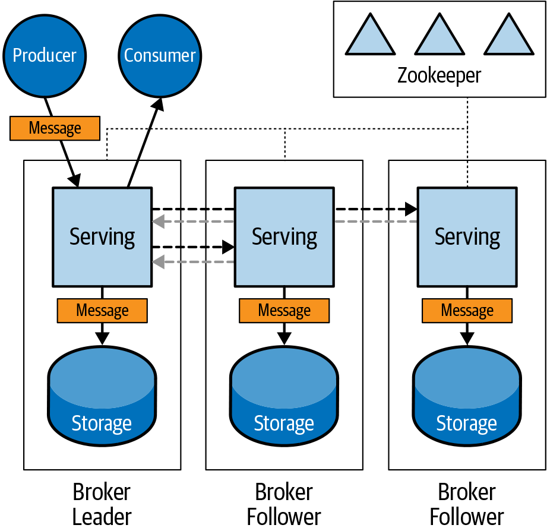
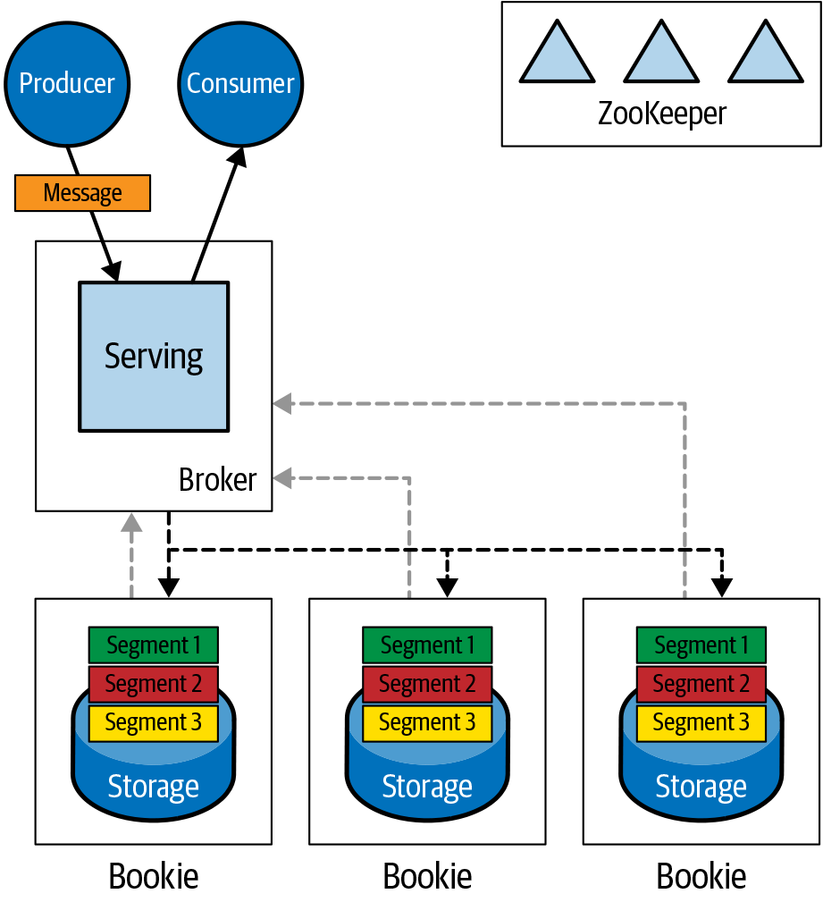
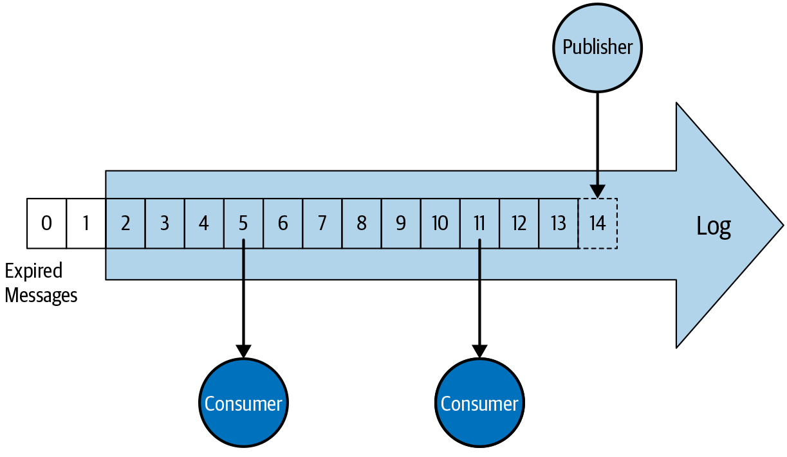
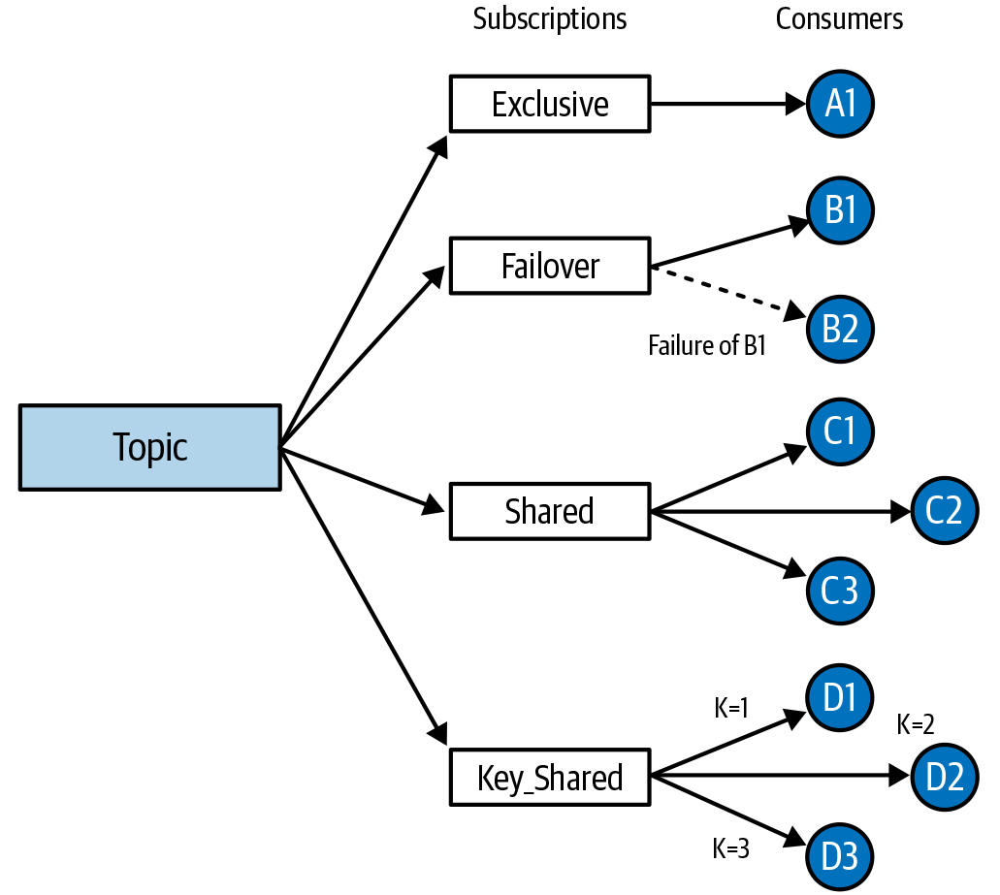
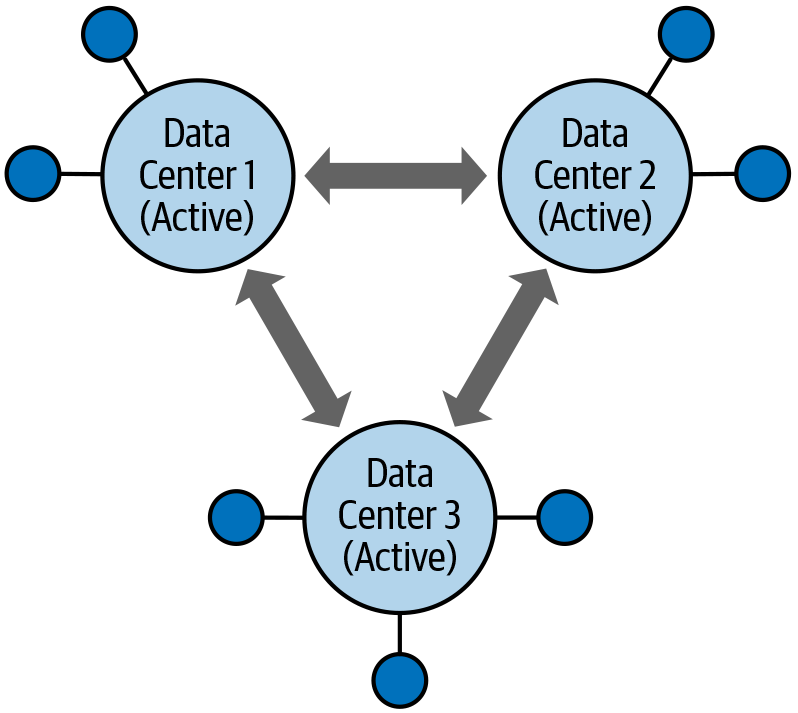
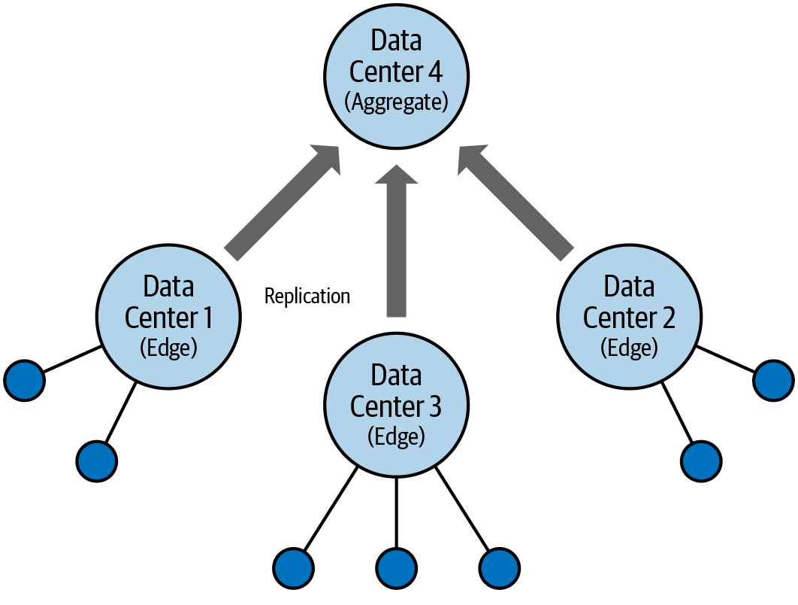

# Apache Pulsar 与 Apache Kafka 之对比分析

Apache Kafka 是一种使用广泛的发布订阅（pub-sub）消息系统。它起源于 LinkedIn，并于 2011 年成为 Apache 软件基金会（ASF）项目。而近年来，Apache Pulsar 逐渐成为 Kafka 的重要替代品，原本被 Kafka 占据的使用场景正越来越多地转向 Pulsar。在本报告中，我们将回顾 Kafka 与 Pulsar 之间的主要区别，并深入了解 Pulsar 为何势头如此强劲。

# 什么是 Apache Pulsar？

与 Kafka 类似，Apache Pulsar 也是起源于一家互联网公司内部，用于解决自己特有的问题。2015 年，雅虎的工程师们需要一个可以在商业硬件上提供低延迟的 pub-sub 消息系统，并且需要支持扩展到数百万个主题，并为其处理的所有消息提供强持久性保证。

雅虎的工程师们评估了当时已有的解决方案，但无一能满足所有需求。于是他们决定着手构建一个全新的 pub-sub 消息系统，使之可以支持他们的全球应用程序，例如邮箱、金融、体育以及广告。他们的解决方案就是后来的 Apache Pulsar，自 2016 年就开始在雅虎的生产环境中运行。

# 架构对比

让我们先从架构角度对比 Kafka 和 Pulsar 这两个系统。由于在开发 Pulsar 的时候 Kafka 已经广为人知，所以 Pulsar 的作者对其架构了如指掌。你将看到这两个系统有相似之处，也有不同之处。如您所料，这是因为 Pulsar 的作者参考了 Kafka 架构中的可取之处，同时改进了其短板。既然一切都源于 Kafka，那我们就先从 Kafka 的架构开始讲起吧。

## Kafka

Kafka 有两个主要组件：Apache ZooKeeper 和 Kafka Broker，如图 1 所示。ZooKeeper 用于服务发现、领导者选举以及元数据存储。在旧版本中，ZooKeeper 也被用来存储消费者组信息，包括主题消费偏移量；但新版本不再这样了。

*图 1. Kafka 架构图*

Kafka Broker 承包了 Kafka 的所有消息功能，包括终止生产者和消费者连接、接受来自生产者的新消息并将消息发送给消费者。为了提供消息持久化保证，Broker 还为消息提供持久化存储功能。每个 Kafka Broker 都负责一组主题。

Kafka Broker 是有状态的。每个 Broker 都存储了相关主题的完整状态，有了这些信息 Broker 才能正常运行。如果一个 Broker 发生失效，并不是任何 Broker 都可以接管它，而必须是拥有相关主题副本的 Broker 才能接管它。如果一个 Broker 负载太高，也不能简单地通过增加 Broker 来分担负载。还需要移动主题（状态）来平衡集群中的负载。虽然 Kafka 提供了用来帮助重平衡的工具，但是要运维 Kafka 集群的话你必须了解 Kafka Broker 与其磁盘上存储的消息状态的关系才行。

消息处理（Serving）是指消息在生产者和消费者之间的流动，它是与 Kafka Broker 中的消息存储相耦合的。如果你的使用场景中所有消息都能被快速地消费掉，那么对消息存储的要就可能较低，而对消息处理的要求则较高。相反，如果你的使用场景中消息被消费得很慢，则需要存储大量消息。在这种情况下，对消息处理的要求可能较低，而对消息存储的需求则较高。

由于消息的处理和存储都封装在单个 Kafka Broker 中，所以无法独立地扩展这两个维度。即便你的集群只对消息处理有较高要求，你还是得通过添加 Broker 实现扩展，也就是说不得不同时扩展消息处理和消息存储。而如果你对消息存储有较高要求，而对消息处理的要求较低，最简单的方案也是添加 Kafka Broker，也就是说还是必须同时扩展消息处理和消息存储。

在扩展存储的场景中，你可以在现有的 Broker 上添加更多磁盘或者增加磁盘容量，但需要小心不要创建出一些具有不同存储配置和容量的独特 Kafka Broker。这种“雪花”（Snowflake）服务器环境比具有统一配置的服务器环境要复杂得多，更难以管理。

## Pulsar

Pulsar 架构中主要有三个组件：ZooKeeper、Pulsar Broker 和 Apache BookKeeper Bookie，如图 2 所示。与 Kafka 一样，ZooKeeper 提供服务发现、领导者选举和元数据存储。与 Kafka 不同的是，Pulsar 通过 Broker 和 BookKeeper Bookie 组件分离了消息处理功能与消息存储功能。

*图 2. Pulsar 架构图*

Pulsar Broker 负责消息处理，而 BookKeeper Bookie 负责消息存储。这是一种分层架构，Pulsar Broker 处理生产者和消费者之间的消息处理，而将消息存储放到 BookKeeper 层。

得益于这种分层架构，Pulsar Broker 是无状态的，这与 Kafka 不同。这意味着任何 Broker 均可接管失效的 Broker。也意味着新的 Broker 上线后可以立即开始在生产者和消费者之间处理消息。为了确保 Broker 之间的负载均衡，Pulsar Broker 内置了一套负载均衡器，不断监视每个 Broker 的 CPU、内存以及网络使用情况，并据此在 Broker 之间转移主题归属以保持负载均衡。这个过程会让 Latency 小幅增加，但最终能让集群的负载达到均衡。

BookKeeper 作为数据存储层，当然是有状态的。提供可靠消息投递保证的消息系统必须为消费者保留消息，所以消息必须持久化存储到某个地方。BookKeeper 旨在跨服务器构建分布式日志，它是一个独立的 Apache 项目，用于多种应用中，而非仅仅是 Puslar 中。 

BookKeeper 将日志切分成一个一个被称为 Ledger 的分片，这样就很容易在 BookKeeper Bookie 节点之间保持均衡。如果 Bookie 节点失效，一些主题会变成小于复制因子（Under Replicated）。发生这种情况 BookKeeper 会自动从存储在其他 Bookie 上的副本中复制 Ledger，而无需等待失效的 Bookie 恢复或等待其他 Bookie 上线。如果添加一个新 Bookie，则能立即开始存储来自已有主题的新 Ledger。由于主题或分区并不从属于某个 Bookie，所以故障恢复过程无需将主题或分区移动到新服务器。

## 复制模型

为了实现消息持久性，Kafka 和 Pulsar 都对每个消息存储多个拷贝或副本。但是他们各自使用了不同的复制模型。

Kafka 使用的是 Leader-Follower 复制模型。对每个主题（确切说是主题分区，稍后我们会详细解释）都会选出一个 Broker 作为 Leader。所有消息最初都写入到 Leader，然后 Follower 从 Leader 读取并复制消息，如图 3 所示。这种关系是静态的，除非发生 Broker 失效。一个消息被写入同一组 Leader 和 Follower Broker。引入新的 Broker 并不会改变现有主题的关系。

*图 3. Kafka leader–follower 复制模型*

Pulsar 使用的则是法定人数投票复制模型（quorum-vote）。Pulsar 并行写入消息的多个副本（Write Quorum）。一旦一定数量的副本被确认写入成功，则该消息被确认（Ack Quorum）。与 Leader-Follower 模型不同，Pulsar 将副本分散（或称为条带化写入）到一组存储节点（Ensemble）中，这能改善读写性能。这也意味着新的节点添加成功后，即可立即服务读写。

In [Figure 4], the message is sent to the broker. It is then broken into segments and sent to multiple bookie nodes. All the bookie nodes store the segments and acknowledge back to the broker. Once the broker has received enough acknowledgements for the segments from enough bookies, it will acknowledge the message back to the producer.

如图 4 所示，消息被发往 Broker，然后被切分成分片（Segment）并写入多个 Bookie 节点。这些 Bookie 节点存储分片并发送确认给 Broker。一旦 Broker 从足够多的 Bookie 节点收到足够多的分片确认，则向生产者发送消息确认。

*图 4. Pulsar quorum–vote 复制模型*

由于 Broker 层是无状态的、存储层是分布式的、并且使用了法定人数投票复制模型（quorum-vote），所以与 Kafka 相比 Puslar 能更容易地处理服务器失效。只需替换掉失效的服务器，Pulsar 即可自动恢复。增加新容量也更容易，只需简单的水平扩展即可。

而且由于计算层和存储层是分离的，所以你可以独立地扩展它们。如果对计算要求较高而对存储要求较低，那么在集群中加入更多的 Puslar Broker 即可扩展计算层。如果存储要求很高而计算要求很低，那么加入更多 BookKeeper Bookie 即可扩展存储层。这种独立的可扩展性意味着你可以更好地优化集群资源，避免在仅需要扩展计算能力时不得不浪费额外的存储，反之亦然。

# Pub–Sub 消息系统概览

Kafka 和 Pulsar 的底层消息模式都是发布订阅，又称 pub-sub。在 pub-sub系统中，消息的发送方和接收方是解耦的，因此彼此透明。发送方（生产者）将消息发送到一个主题，而无需知道谁将接收到这些消息。接收方（消费者）订阅要接收消息的主题。发送方和接收方不互相连接，且随时间推移可能变化。

*图 5. Pub–sub 消息模式：每个订阅者都能收到生产者发送的一条消息拷贝*

Pub-sub 消息模式的一个关键功能是单个主题上可能有多个生产者与订阅者。如图 5 所示，多个发布应用可以发送消息到一个主题，多个订阅应用可以接收这些消息。重要的是，每个订阅应用都会收到自己的消息拷贝。所以如果发布了一条消息并且有 10 个订阅者，那么则会发送 10 条消息拷贝，每个订阅者收到一条消息拷贝。

Pub-sub 消息模式并不是什么新鲜事物，且可由多种消息系统实现：RabbitMQ、ActiveMQ、IBM MQ，数不胜数。Kafka 与这些传统消息系统的区别在于，它有能力扩展到支持大量消息，同时保持一致的消息延迟。

与 Kafka 类似，Pulsar 也支持 pub-sub 消息模式，且也能支持大量消息且具有一致延迟。Kafka 使用消费者组来实现多个消费者接收同一消息的不同拷贝。Kafka 会向关联到主题的每个消费者组发送一条消息。Pulsar 使用订阅（Subscription）来实现相同的行为，Pulsar 向关联到主题的每个订阅发送一条消息。 

## 日志抽象

Kafka 与传统消息系统的另一个主要区别是其将日志作为处理消息的主要抽象。生产者写入主题，即写入日志；而消费者独立地读取日志。然而与传统消息系统不同，消息被读取后并不会从日志中删除。消息被持久化到日志中直至配置的时间到期。Kafka 消费者确认消息后，并不会删除消息，而是提交一个偏移量值来表示它已读取了多少日志。此操作不会从日志中删除消息或以任何方式修改日志。总之，日志是不可变的。

To prevent the log from becoming infinitely long, messages in the log expire (typically) after a period of time (retention period). Expired messages are removed from the log. In Kafka, the default retention period is seven days. [Figure 6] illustrates how published messages are appended to the log, while consumers read at different offsets. In time, messages in the log expire and are removed.

为了防止日志变得无限长，日志中的消息在一段时间（保留期）后会过期。过期的消息会从日志中删除。Kafka 默认的保留期是七天。图 6 展示了发布的消息是如何附加到日志中，而消费者以不同的偏移量读取它。日志中的消息到期后会过期并被删除。

*图 6. 日志抽象*

## 消息重放

利用日志抽象可以允许多个消费者独立地读取同一个主题。同时还能支持消息重放。由于消费者只是从日志中读取并提交日志偏移量，因此只要将偏移量移动到较早位置就能很容易地让消费者重放已消费过的消息。支持消息重放有很多优势。例如，有 bug 的应用程序修复后可以重放之前消费过的消息以纠正其状态。在测试应用程序或开发新应用程序时，消息重放也很有用。

与 Kafka 类似，Pulsar 也使用日志来抽象其主题，只不过具体实现有所不同。这意味着 Puslar 也能支持消息重放。在 Puslar 中，创建的每个订阅都有一个游标来跟踪其在主题日志中的消费位置。创建订阅的时候可以指定游标从主题的最早或最新消息开始。你可以将订阅游标倒回到特定消息或特定时间（例如倒回 24 小时）。

# 传统消息模型

到目前为止，我们看到 Kafka 与 Pulsar 有许多相似之处。他们都是能处理大量消息的 pub-sub 消息系统，都使用日志来抽象主题，并支持消息回放。他们不同的地方是对传统消息模型的支持有所不同。

在传统消息模型中，消息系统负责确保消息被投递给消费者。消息系统会跟踪消费者是否已经确认消息，并周期性地将未被确认的消息重新投递给消费者，直至被确认为止。一旦消息被确认，即可被删除（或标记为将来删除）。而未被确认的消息永远不会被删除，它将永远存在。而已确认的消息永远不会再发送给消费者。

Pulsar 利用订阅充分支持上述模型。 由于这种能力，Puslar 能够支持额外的消息模型，专注于消息如何被消费。

# 队列与竞争消费者

首先我们来看传统队列模式。这种模型常用于队列中的消息代表一系列将要完成的工作时（工作队列）。你可以使用单个消费者从队列中读取消息并执行工作，但更常见的做法是在多个消费者中分配工作。这种模式被称为竞争消费者模式，如图 7 所示。

在竞争消费者模式中，队列用于存储需要很长时间来处理的消息，例如转换视频。一条消息被发布到队列中后，被消费者读取并处理。一旦消息被处理，消费者即发送确认，然后消息会从队列中删除。如果是单个消费者，则队列中的所有消息会被阻塞，直到消息被处理并确认。

*图 7. 竞争消费者：每条消息被一个消费者处理一次*

为了改善整个流程并保持队列不被填满，你可以往队列中添加多个消费者。然后多个消费者会“竞争”从队列中获取消息并处理它们。如果上述视频转换的例子中我们有两个消费者，则相同时间内能处理的视频量会增加到两倍。如果这还不够快，我们可以添加更多消费者来提高吞吐量。

为了更有效，工作队列需要始终将消息分发给那些有能力处理队列消息的消费者。如果消费者有能力处理消息，则队列就将消息发给它。

## Kafka

Kafka 使用消费者组和多分区实现竞争消费者模式。Kafka 主题由一个或多个分区组成。消息被发布后通过 round-robin 或者消息 key 分布到主题的分区中，随后被消费者组从主题分区中读取。

需要注意的是，Kafka 的一个分区一次只能被一个消费者消费。要实现竞争消费者模式，则每个消费者要有对应的分区。如果消费者多于分区，则多出来的消费者就会被闲置。举个例子，你的主题有两个分区，则消费者组中最多有两个活跃消费者。如果增加第三个消费者，则该消费者没有分区可以读取，所以不会参与从队列中竞争工作（消息）。

这意味着在创建主题时就需要明确有多少竞争消费者。当然你可以增加主题分区数，但这是相当重的改动，尤其当根据 key 分配分区时。除了 Kafka 消费者与主题的对应关系外，往消费者组中添加消费者会重平衡该主题的所有消费者，这种重平衡会导致对所有消费者的消息投递都暂停掉。

所以说 Kafka 确实支持竞争消费者消息模式，但是需要你仔细管理主题的分区数，确保添加新消费者时能真的处理消息。另外，与传统消息系统不同，Kafka 不会周期性地重新投递消息以便可以再次处理这些消息。如果想要有消息重试机制，你需要自己实现。

Kafka 确实比传统消息系统有个优势。竞争消费者模式的一个弊端是消息可能被乱序处理。因为竞争消费消息的多个消费者可能处理速率不同，很有可能消息会乱序处理。如果消息代表独立的工作，那么这不是什么问题。但如果消息代表像金融交易这样的事件，那有序性就很重要了。

由于 Kafka 分区一次只能被一个消费者消费，所以 Kafka 可以在竞争消费者模式下保证相同 key 的消息被顺序投递。如果消息是按照 key 路由到分区，则每个分区中的消息是按照发布的顺序存储的。消费者可以消费该分区并按顺序获取消息。这使得你可以扩展消费者以并行处理并保持消息顺序，当然这一切都需要仔细的规划才行。

## Pulsar

Pulsar 中的竞争消费者模式就很容易实现了，只需在主题上创建共享订阅即可。之后消费者使用此共享订阅连接到主题，消息以 round-robin 方式被连接到该订阅上的消费者消费。消费者的上线下线并不会像 Kafka 那样触发重平衡。当新的消费者上线后即开始参与 round-robin 的消息接收。这是因为与 Kafka 不同，Pulsar 并不使用分区来在消费者之间分发消息，而完全通过订阅来控制。Pulsar 当然也支持分区，这一点我们稍后将讨论，但消息的消费主要是由订阅控制，而不受分区控制。

Pulsar 订阅会周期性地将未确认消息重新投递给消费者。不仅如此，Pulsar 还支持高级确认语义，例如单条消息确认（选择性确认）和否定确认（negative acknowledgment），这一点对工作队列场景很有用。单条消息确认允许消息不按顺序确认，所以慢速消费者不会阻塞向其他消费者投递消息，而累积确认是可能发生这种阻塞的。否定确认允许消费者将消息放回主题中，之后可以被其他消费者处理。

Pulsar 支持按 key 将消息路由到分区，所以也可以像 Kafka 那样实现竞争消费者。共享订阅这种实现方式更简单，但是如果你想在横向扩展消费者并行处理时也保证按 key 有序，Pulsar 也是可以实现的。

## Pulsar Subscription Models

The shared subscription is an easy way to implement a work queue in Pulsar. Pulsar also supports additional subscription models that enable other message consumption patterns: exclusive, failover, shared, and key_shared, which are shown in [Figure 8].

With an exclusive subscription, no more than one consumer is allowed to consume messages from the topic. If any other consumer attempts to consume a message, it is rejected. This is useful if you need to guarantee that messages are processed in order by a single consumer.

With a failover subscription, multiple consumers are allowed to connect to a topic, but at any given time only one is allowed to consume from the topic. This establishes an active–standby relationship where one consumer is active for the subscription and any other consumers are on standby waiting to take over if the active consumer fails. When the active consumer disconnects or fails, all unacknowledged messages are redelivered to one of the standby consumers.

*Figure 8. Pulsar subscription models: exclusive, failover, shared, and key_shared*

As was already mentioned, one of the weaknesses of the competing consumers pattern as it is implemented in a shared subscription model is that messages can be processed out of order. In both Kafka and Pulsar, you can get around this by routing messages to partitions by key. Pulsar has recently introduced a new subscription model called key_shared that makes this even easier. This subscription model has the advantages of in-order delivery of messages by key without having to deal with partitions. Messages can be published to a single topic and distributed to multiple consumers like with a shared subscription. However, individual consumers only receive messages for a single key. With this type of subscription, it is possible to get in-order delivery of messages by key without having to partition the topic.

# Pulsar: Pub–Sub and Queue Together

As we have seen, both Kafka and Pulsar are able to support pub–sub messaging. They both use a log abstraction for their topics, so they are able to replay messages that have already been processed by consumers. But Kafka only has limited support for different ways a message can be consumed. It does not do automatic message redelivery and cannot guarantee that an unacknowledged message will not be lost. In fact, all messages outside the retention period are deleted, whether or not they have been consumed. Work queues with competing consumers can be implemented in Kafka, but with several caveats and considerations.

Because of these limitations, organizations needing high-performance pub–sub messaging, delivery guarantees, and traditional messaging patterns often implement a traditional message broker like RabbitMQ alongside Kafka. They use Kafka for their high-performance pub–sub use cases and RabbitMQ for use cases that require delivery guarantees, such as work queues.

Pulsar can support high-performance pub–sub and traditional messaging patterns with delivery guarantees in a single messaging system. It is not difficult to implement a work queue using Pulsar—in fact, this was one of the original use cases that Pulsar was designed to handle. In organizations that have deployed parallel messaging systems, Kafka to handle high volume pub–sub and RabbitMQ to handle work queues, Pulsar can be used to consolidate down to one messaging system. Or even if only one type of messaging is initially required, Pulsar can be deployed to future proof against the emergence of new use cases.

Operating one messaging system instead of two is, obviously, a lot easier, requiring fewer resources, both IT and human.

# Log Abstraction

Now that we have looked at the high-level architecture of Kafka and Pulsar and covered the messaging patterns that can be implemented in both systems, let’s go into more detail about the building blocks of these systems. First, we’ll discuss the log abstraction.

The Kafka team deserves credit for the insight that a log is a great abstraction for a real-time data exchange system. Because logs are append-only, data can be written to them quickly, and because the data in a log is sequential, it can be extracted quickly in the order that it was written. Sequential reading and writing is fast, random is not. Persistent storage interactions are a bottleneck in any system that offers data guarantees, and the log abstraction makes this about as efficient as possible. Both Kafka and Pulsar use the log as their fundamental building block.

For the sake of simplicity, let’s assume a single-partition Kafka topic in the following sections, so that topic and partition are synonymous.

## Kafka Log

In Kafka, each topic is a log. Logs are stored on the Kafka broker as a single unit. A log, though implemented as a series of files, cannot be split between multiple brokers or between multiple disks on the same broker. This log as-a-single-unit generally works well, but it can cause complications at scale and during maintenance activities.

For example, the maximum size of any log is limited by the disk that it is on. So, the disk on the broker that stores the log constrains the size of the topic. Adding another disk to the broker won’t help, since logs are a single unit and can’t be split across disks. The only option is to increase the size of the disk. In cloud environments this is possible, but if you are running on physical hardware, increasing the size of an existing disk is not an easy undertaking.

Another complication of having this one-to-one relationship between the log and its backing files comes when trying to perform maintenance operations on a live system. If a broker server fails or you need to add a new broker to accommodate higher load, you end up copying sometimes large sets of log files between servers. Doing these large file copies while trying to keep up with real-time data can create a lot of strain on a Kafka cluster.

## Pulsar Distributed Log

Like Kafka, Apache Pulsar uses a log abstraction as the basis of its real-time messaging system. Every topic is a log in Pulsar as well. However, it takes a different approach to writing the log to storage. Instead of writing the log as a single unit on a single server, Pulsar breaks up the log into segments or ledgers. It then distributes those ledgers across multiple servers. In this way, it creates a distributed log that resides on multiple servers.

A distributed log has several advantages. The maximum size of the log is no longer limited by the disk capacity of a single server. Since the segments are distributed across multiple servers, the log can grow to be as big as the total storage capacity of all the servers. Increasing the capacity of the distributed log is as simple as adding a new server to the cluster. Once the new server comes online, the distributed log can start using the extra capacity to write new log segments. There is no need to resize disks or rebalance partitions to distribute the load. And if a server fails, recovering from that failure is easier. Lost segments can be recovered from multiple different servers, improving recovery time.

As you can imagine, getting a distributed log to work reliably is difficult. That is why Pulsar uses another Apache project, BookKeeper, to implement its distributed log. As part of running Pulsar, you need to run an Apache BookKeeper cluster. Although this introduces operational complexity, it provides the building blocks for the distributed log using a proven and widely adopted technology that is optimized for this use case. BookKeeper is designed for robust, low-latency writes and reads. The architecture of BookKeeper separates writing and reading onto separate disks so that, for example, slow consumers won’t impact the ability of producers to publish new messages.

BookKeeper also allows Pulsar to provide high durability guarantees. When a message is stored in BookKeeper, it is flushed to disk before it is acknowledged back to the producer. If the server running BookKeeper fails, all acknowledged messages are guaranteed to have been stored permanently on disk. BookKeeper is able to provide this high durability guarantee while maintaining low latency.

Contrast this to Kafka, which flushes messages to disk periodically by default. This means that a failure of a Kafka broker will almost always cause messages to be lost because they haven’t been flushed to disk. Of course, if you are running with in-service replicas, these lost messages can be recovered, but under a similar failure of a BookKeeper server, no recovery would be necessary since no messages would be lost. Kafka can be configured to flush each message to disk, but this comes with a performance penalty.

## Tiered Storage

Another advantage of separating the serving and storing in Pulsar is that it allows for the introduction of a third layer to the architecture: long-term (or cold) storage. Pulsar and BookKeeper are optimized for fast access to the messages stored in its topics. However, if you have a large set of messages but don’t need fast access to those messages, or you only need fast access to the latest messages, Pulsar lets you push those messages to cloud object storage such as AWS S3 or Google Cloud Storage. It does this by offloading older segments of a topic to the cloud provider and then removing them from the bookie local storage.

Cloud object storage is significantly cheaper than the high-speed SSD drives that you would typically use to build a high-performing messaging cluster, so operational costs can be reduced. Since cloud storage provides practically infinite storage capacity, you don’t have to worry about exceeding the storage capacity of your cluster. You could have one very large topic that mostly resides in cloud storage, while all the other smaller topics are served by the high-speed disks attached to the bookie nodes.

Moving to this three-layer architecture can fit nicely with use cases that require permanent storage of messages, such as event sourcing. With event sourcing all changes in state are recorded as events, which can be saved as messages in Pulsar. The current state of an application is determined by the entire history of events until the current time. To ensure that you can always reconstruct the current state, you must save the entire event history. Given Pulsar’s durability guarantees, practically infinite storage capacity when using tiered storage, and ability to replay all messages in a topic, it can be a good fit for event sourcing application architectures.

# Partitions

If you have used Kafka at all you are familiar with partitions. We have already touched on them several times in this report because it is unavoidable. Partitions are a fundamental concept in Kafka, and can be very useful. Pulsar also supports partitions, but they are optional.

## Kafka Partitions

In Kafka, all topics are partitioned. A topic may have only one partition, but it has to have at least one partition. Partitions are important because they are the fundamental unit of parallelism in Kafka. By spreading the work across partitions and therefore multiple brokers, the rate that can be processed by a single topic goes up. When Kafka was created, partitioning was needed to meet the high-throughput use cases Kafka was designed to tackle, especially since the goal was to be able to use commodity hardware.

In the years since Kafka’s inception, the capacity of commodity hardware has improved. Plus, there have been performance improvements in the Java virtual machine that Kafka runs on. These hardware and software improvements mean that today you can get good performance with a single partition using commodity hardware. From a performance perspective, a topic with a single partition is good enough for many use cases.

However, as we’ve already discussed, if you ever want to have multiple consumers read from your topic in Kafka, you can’t use a single partition. That’s because partitions are the unit of parallelism for production and consumption in Kafka. So even if a single partition is good enough for the incoming messaging rate to a topic, you will probably want to use multiple partitions so that you have the option of adding multiple consumers in the future. Yes, you can add partitions to a topic later, but if you are using key-based partitioning, this may change which keys are assigned to which partitions, which can affect the in-order processing of messages in a partition. Partitions consume resources (for example, file handles on the broker, memory on the client) so they are not lightweight. And although you can increase the number of partitions on a topic, you can never decrease the number of partitions on a topic.

Since partitions are fundamental to Kafka, to properly use Kafka you need to understand how they work. You need to consider the number of partitions you need (or might need in the future) when creating a topic. When connecting consumers, you need to understand how they interact with partitions in their consumer groups. And if you operate a Kafka cluster, everything works at the partition level, so you need to be partition-centric when doing maintenance and repairs.

## Pulsar Partitions

Pulsar also supports partitions, but they are completely optional. In fact, it is possible to run Pulsar without using partitions at all. You can create topics that you can publish a high volume of messages into and have multiple consumers consuming them from without using partitions. If you need additional performance or need key-based, in-order message consumption, you can create partitioned topics in Pulsar. They are fully supported, providing most of the same capabilities as Kafka.

In Pulsar, partitions are implemented as a collection of topics with a suffix to indicate the partition number. For example, if you create a topic “mytopic” with three partitions, three topics will be automatically created with the names “mytopic-partition-1,” “mytopic-partition-2,” and “mytopic-partition-3.” Producers can connect to the main topic, “mytopic,” and the messages will be sent to the partition topics based on the routing mode defined by the publisher. It is also possible to publish directly to a partition topic. Similarly, a consumer can connect to the main topic or one of the partition topics. Like Kafka, you can increase the number of partitions for a topic, but you can never decrease the number of partitions.

Since partitions are optional in Pulsar, working with Pulsar is simpler, especially when you are first learning it. You can safely ignore partitions in Pulsar, unless you have use cases that demand the features provided by partitions. Not only does this simplify the operation of a Pulsar cluster, it makes dealing with Pulsar client APIs easier. Partitions are a useful concept, but if you can get by without dealing with them, it helps to simplify an inherently complex technology.

# Performance

Kafka is known for its performance. It made its mark by being able to support high volumes of messages in real-time environments. Comparing performance between messaging systems can be tricky. All systems have performance sweet spots and performance blind spots. To make a fair comparison between them is difficult.

One project that aims to make performance comparisons between messaging systems fair is the [OpenMessaging Project](http://openmessaging.cloud/), a Linux Foundation Collaborative Project. The OpenMessaging Project, which is supported by multiple providers of messaging systems, has a goal of providing vendor-neutral and language-independent standards for messaging and streaming technologies. The project includes a performance testing framework that supports various messaging technologies, including Kafka and Pulsar.

The idea is that by using a standard test framework and methodology, a certain degree of fairness can be introduced into the evaluation. All the code for the OpenMessaging Project is open source and anyone is welcome to run the benchmark tests and produce their own results.

Going through a detailed performance analysis between Kafka and Pulsar is outside the scope of this report. However, there are published results using the OpenMessage Project benchmark framework that indicate Pulsar outperforms Kafka.

A [report](https://oreil.ly/vGoPy) published by GigaOm provides these headline results:

- Up to 150% higher maximum throughput with Pulsar
- Up to 40% lower message latency and greater consistency in latency with Pulsar
- Better scalability that delivers consistent results across a range of message sizes and partition counts

To validate some of these results, I have done a [detailed comparison](https://oreil.ly/34h_v) of the latency between Kafka and Pulsar using the OpenMessage Project benchmark framework. In that comparison, I came to the conclusion that Pulsar provides more predictable latency over time. In many cases, Pulsar provides lower latency than Kafka, especially if you need strong durability guarantees or a large number of partitions.

# Tenancy

Tenancy is the number of users or groups of users that can use the system independently. In a single tenant system, all the resources of the system are shared, so users of the system have to be aware of what other users of the system are doing. Since the resources are shared, this introduces contention and possible collisions. When using a single-tenant system with multiple user groups, you typically need to use multiple copies of the system, one for each group, to provide isolation and privacy.

In a multitenant system, different user groups, or tenants, can use the system independently. Each tenant is separate from the other tenants of the system. Resources are divided between tenants so each tenant has their own private instance of the system. There is one system, but each tenant gets their own virtual, isolated environment. A multitenant system can support multiple user groups.

Since a messaging system is core infrastructure, it will eventually be used by different teams for different projects. Having to create a new cluster for each team or project is operationally complex and doesn’t make efficient use of resources. Because of this, multitenancy in a messaging system is a desirable feature.

## Pulsar

Multitenancy was a key design requirement of Pulsar. Because of that, Pulsar has several multitenancy features that allows it to support multiple teams or multiple projects within a single Pulsar system.

In Pulsar, a tenant has its own virtual messaging environment separate from the other tenants. Topics created by one tenant are separate from topics created by another tenant. Typically, a tenant will be used by all members of a team or department. Each tenant can have multiple namespaces. A namespace is a grouping of topics. The same topic name can exist in multiple namespaces. A namespace is a convenient way to group all the topics involved in specific project.

Namespaces are also a mechanism for sharing policy configuration between topics. For example, all the topics that need a retention time of 14 days can be grouped into a namespace. By setting this policy on the namespace, all topics in that namespace inherit that policy.

When there are multiple tenants sharing a resource, it is important to have mechanisms to ensure that all tenants get fair access. You want to ensure that one tenant doesn’t consume all resources, starving out the other tenants.

Pulsar has a number of policies that can be used to ensure that a single tenant doesn’t consume all the resources of the cluster. There are policies that limit outbound message rate, unacknowledged message storage, and message retention periods. These policies can all be set at the namespace level, so that groups of topics can have different policies.

In order for multitenancy to work, Pulsar supports authorization at the namespace level. This means you can limit access to topics in a namespace. You can control who is allowed to create topics in a namespace and who is allowed to produce and consume from those topics.

## Kafka

Kafka is a single-tenant system. There is a global namespace for all topics. Policies such as retention time can be set as a global default, or overridden on individual topics. There is no ability to group related topics together or apply policy on an arbitrary group of topics.

For authorization, Kafka supports access control lists (ACLs), which allow you to restrict who can produce and consume from a topic. ACLs allows fine-grain control over authorization in the cluster. You can set policies on various resources such as the cluster, topics, and consumer groups. You can also specify various specific operations such as create, describe, alter, and delete. In addition to authorization based on user (principal), you can also define host-based authorization. For example, you can allow User:Bob to write to and read from a topic but only from IP address 198.51.100.0. This detailed level of authorization and host-based restrictions is not available in Pulsar, which only supports a handful of operations (administer, produce, consume) and does not offer host-based authorization.

Although Kafka has more flexibility with its authorization controls, it is still fundamentally a single-tenant system. If multiple groups are using the same Kafka cluster, they need to ensure that their topic names don’t collide and that ACLs are applied correctly. With Pulsar, multitenancy is built in, so sharing a cluster between different teams and project groups is straightforward.

# Geo-Replication

For systems like Kafka and Pulsar to achieve high performance, it’s important for their components to be located close together so they can achieve low-latency communication between them. This means that Kafka and Pulsar are deployed in a single data center with high-speed networking between the components. Replication of messages within a cluster protects you from message loss and downtime when one (or possibly more) components (compute, storage, network) of the cluster fails. In cloud environments, the components can be distributed between availability zones within a data center (region) to protect against the failures of a zone.

If the entire data center fails or becomes isolated then there will be an outage (or loss, in the event of a disaster) of the messaging system. If this is not acceptable for your use case, then you can use geo-replication. With geo-replication, messages are replicated to another cluster at a remote location. For every message published in one data center, that message is automatically—and reliably—copied to another data center. This protects against the failure of an entire data center.

Geo-replication is also useful for global applications that have messages produced in one part of the world being consumed by consumers in other parts of the world. By replicating messages to remote data centers, load can be distributed and responsiveness for clients can be improved.

## Pulsar

When the team at Yahoo! set out to build what would eventually become Apache Pulsar, the ability to replicate messages between geographically distant data centers was a key requirement. They needed to make sure that messages would still be available even if an entire data center failed. So with Pulsar, geo-replication is a core feature, fully integrated into the administration interfaces. Geo-replication can be enabled and disabled at the namespace level. The administrator can easily configure which topics will be replicated and which will not be replicated. Individual producers can even exclude certain data centers from receiving a copy of the messages that it publishes.

*Figure 9. Active–standby replication*

Geo-replication in Pulsar supports multiple topologies, such as active-standby, active–active, full mesh, and edge aggregation. [Figure 9] illustrates active–standby replication. All messages published to the active data center (Data Center 1) are replicated to the standby data center (Data Center 2). If the active data center fails, clients can connect to the standby data center. For active–standby replication, Pulsar has recently introduced replicated subscriptions. This feature keeps the subscription state synchronized between the active and standby clusters so that applications can switch to the backup data center and pick up where they left off.

In active–standby replication, clients are only connected to one data center at a time. In active–active replication, which is shown in [Figure 10] in a full-mesh configuration, clients connect to multiple data centers. The messages published in one data center are replicated to multiple data centers.

[Figure 11] shows an edge-aggregation topology. In this topology, clients connect to multiple data centers that replicate the messages to a central data center for processing. If the edge data centers are located near the clients, then this allows for quick message acknowledgment of published messages even if the central data center is geographically distant.

*Figure 10. Active–active, full-mesh replication*

*Figure 11. Edge aggregation*

It is also possible to do synchronous geo-replication with Pulsar. In a typical geo-replication setup, the message replication is done asynchronously. A producer sends a message to its primary data center. The message is persisted and acknowledged back to the producer. It is then reliably copied to the remote data center. The overall process is asynchronous because the message is acknowledged to the producer before it is replicated to the remote data center. This works fine as long as the remote data center is operational and reachable through the network. However, if there is a problem with the remote data center or the network connection is slow, the acknowledged message may be waiting to be copied to the remote data center. If the primary data center fails before the message can be copied to the remote data center, then the message can be lost.

If this type of loss is not acceptable for your use case, you can configure Pulsar to do synchronous replication. With synchronous replication the message is not acknowledged back to the production until it is safely stored in multiple data centers. Since the messages need to be sent to multiple data centers that are geographically distant, this setup will take longer to acknowledge published messages because of the network latency between the data centers. However, this ensures that messages will not be lost even in the event of the complete failure of a data center.

Pulsar has a rich set of geo-replication functionality that supports almost any configuration you can think of. The configuration and management of geo-replication is fully integrated into Pulsar and does not require external packages or extensions.

## Kafka

There are multiple ways to do geo-replication in Kafka, or mirroring, as it is called in the Kafka documentation. Kafka includes a tool called MirrorMaker that replicates messages from one cluster to another cluster as they are produced. It is a simple tool that connects a Kafka consumer in one data center to a Kafka producer in another. It cannot be dynamically configured (you need to stop and start the tool to change its configuration) and it does not provide any configuration or subscription synchronization between the local and remote cluster.

Another geo-replication option is uReplicator, which was developed by Uber and then open sourced. Uber created uReplicator to address many of the shortcomings of MirrorMaker, improving its performance, scalability, and operations. Certainly, uReplicator is a better geo-replication solution for Kafka. However, it is an independent distributed system with controller and worker nodes that needs to be operated in parallel with the Kafka cluster.

There are also commercial solutions for geo-replication in Kafka, such as Confluent Replicator. The Confluent Replicator supports active–active replication, synchronizes configuration between clusters, and is easier to operate than MirrorMaker. It depends on Kafka Connect, which is a distributed system that needs to be operated in parallel with the Kafka cluster.

Geo-replication is possible in Kafka, but it’s not simple. From having to choose among multiple solutions to having to run parallel tools or entire distributed systems to support it, geo-replication is complex, especially when compared to Pulsar’s built-in geo-replication capabilities.

# Ecosystem

We have spent a lot of time looking at the core Kafka and Pulsar technology. Now let’s zoom out and take a look at the bigger picture of the ecosystem that surrounds each project.

## Community and Related Projects

Kafka was open sourced in 2011 while Pulsar was open sourced in 2016. So Kafka had a five-year headstart on creating a community and having others build around it. Kafka is widely deployed and many have built open source and commercial offerings. There are several commercial Kafka distributions available and many cloud providers offer managed Kafka services.

Not only are there many options for running Kafka, there are many open source projects that provide clients, tools, integrations, and connectors for Kafka. Since Kafka is run by large, internet-scale companies, many of these projects have originated from companies like Salesforce, LinkedIn, Uber, and Shopify. And, of course, there are many commercial complementary pieces available for Kafka.

Kafka knowledge is also widely distributed, so answers to questions you have about Kafka are easy to find. There are many blog posts, online courses, over 15,000 Stack Overflow questions, more than 500 contributors on GitHub, and plenty of people with extensive experience using Kafka.

Clearly, Pulsar cannot hope to have matched the size of the Kafka ecosystem and community in the relatively short time it has been an open source project. However, it did quickly progress from an incubator project in Apache to a top-level project and has shown steady increase in many of its community metrics, such as GitHub contributors and members of its Slack workspace. And although it is relatively small, the Pulsar community is welcoming and active.

Despite all that, Kafka has a clear advantage in this category.

## Open Source

Both Kafka and Pulsar are open source projects run by the ASF. There has been a lot of discussion recently about open source licensing. Some providers of open source software have modified their licenses to prevent the cloud providers from using their open source projects in some applications. This practice highlights an important difference between open source projects.

Some open source projects are controlled by commercial vendors and some are controlled by software foundations, like the ASF. Open source projects are free to change their software license. Today they may be using a permissive license like Apache 2.0 or MIT, but tomorrow they could move to a more restrictive licensing scheme. If you are using an open source project controlled by a commercial vendor, you run the risk of that vendor changing the license for reasons specific to their business. If that occurs and you are using the software in a way that violates the new license and you want to be able to pick up new updates (for example, security patches), you will have to find a friendly fork of the project, take on maintenance of your own fork, or perhaps pay the commercial vendor for a license.

Open source projects controlled by software foundations are very unlikely to change their licensing. The widely used Apache 2.0 license has been around since 2004. And if a software foundation did change the license of their open source projects, it is unlikely that they will make them more restrictive, since most foundations have a mandate to provide software free of charge and free of restrictions.

When evaluating open source software, this distinction is something to keep in mind. Kafka is an open source project under Apache. However, many of the components that are part of the Kafka ecosystem are open source, but not under Apache control, such as:

- All client libraries except Java
- Various connectors for integrating with third-party systems
- Monitoring and dashboard tools
- Schema registry
- Kafka SQL

The Apache Pulsar open source project has a wider range of its ecosystem within the project. It includes Java, Python, Go, and C++ clients as part of the main project. There are several connectors as part of the Pulsar IO package, such as Aerospike, Apache Cassandra, and AWS Kinesis. Pulsar comes with a schema registry and an SQL-based mechanism for querying topics called Pulsar SQL. It includes a dashboard application as well as Prometheus-based metrics and alerting capabilities.

Because all of these components are in the main Pulsar project under Apache stewardship, their licensing is unlikely to become more restrictive. Also, as long as the project as a whole is being actively maintained, these components are also being maintained. Tests are regularly run against these components and incompatibilities are fixed before a new Pulsar version is released.

# Summary

Apache Pulsar has been gaining momentum as an alternative to Apache Kafka. In this report, we compared Kafka and Pulsar in various dimensions, which are summarized in [Table 1].

| Dimension                          | Kafka                                       | Pulsar                               |
| :--------------------------------- | :------------------------------------------ | :----------------------------------- |
| Architectural components           | ZooKeeper, Kafka broker                     | ZooKeeper, Pulsar broker, BookKeeper |
| Replication model                  | Leader–follower                             | Quorum-vote                          |
| High-performance pub–sub messaging | Supported                                   | Supported                            |
| Message replay                     | Supported                                   | Supported                            |
| Competing consumers                | Supported with limitations                  | Supported                            |
| Traditional consuming patterns     | Not supported                               | Supported                            |
| Log abstraction                    | Single node                                 | Distributed                          |
| Tiered storage                     | Not supported                               | Supported                            |
| Partitions                         | Required                                    | Optional                             |
| Performance                        | High                                        | Higher                               |
| Geo-replication                    | Available through tool or external projects | Built-in                             |
| Community and related projects     | Large and mature                            | Small and growing                    |
| Open source                        | Mixture of ASF and others                   | All ASF                              |

We compared the architecture of both systems and their differing replication models. Both systems use Apache ZooKeeper and a broker, but Pulsar splits the broker into two layers: a message serving layer and a message storage layer. Pulsar uses the Apache BookKeeper project for its storage layer. This separation of serving and storing, as well as the horizontal scalability of Apache BookKeeper, makes it natural to run in cloud native environments like Kubernetes.

Both Kafka and Pulsar use message replication for durability. Kafka uses a leader–follower replication model, and Pulsar uses a quorum–vote replication model.

We looked at the messaging patterns supported by both Kafka and Pulsar, as well as the messaging patterns of traditional message brokers such as RabbitMQ that only Pulsar is able to support. Because Pulsar supports the pub–sub, streaming messaging patterns and the queue-based patterns of traditional message brokers, in organizations that run parallel Kafka and RabbitMQ messaging systems, it is possible to consolidate those systems into a single Pulsar messaging system. For organizations looking to deploy a new messaging system for either streaming or traditional queuing, using Pulsar will future proof your infrastructure in the event that requirements to support new messaging patterns arise.

Both Kafka and Pulsar are built on the log abstraction, where messages are appended to an immutable log. With Kafka, the log is bound to the broker node, but with Pulsar, the log is distributed between the bookie nodes.

Partitions are a fundamental concept in Kafka, but an optional one for Pulsar. This means that Pulsar can provide a degree of simplification over Kafka operationally and when dealing with the client APIs.

Pulsar offers features such as tiered storage, built-in geo-replication, and multitenancy that are not available on Kafka. Reports suggest that Pulsar has a performance advantage over Kafka in both latency and throughput. The vast majority of Pulsar’s open source components are controlled by the ASF, not a commercial entity.

Although Pulsar cannot match the Kafka ecosystem and community, it has the edge over Kafka in many dimensions. Given these advantages, it is not surprising that Pulsar is gaining momentum as an alternative to Kafka. It can also be expected to continue to gain ground once more people become aware of its advantages.

# Acknowledgments

I would like to thank Sijie Guo for his technical review, Jeff Bleiel for his insights and patience, and Jess Haberman for her enthusiasm and support.